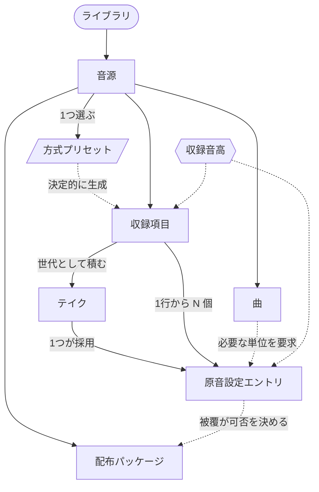

# オブジェクトモデル

`docs/design/redesign-plan.md` の Phase 3。M7 まで見て骨格を決める。**この文書はまだオブジェクトと関連まで。** ビュー構成とナビゲーションは、ここが固まってから足す。

`Q-PLT-004` が open で M6 を塞いでいるので、描画面の性質に依存する部分は穴のまま残す。

## オブジェクト

同一性を持ち、永続し、一覧でき、名指しできるもの。

| オブジェクト | 何か | 同一性 | 状態 | 由来 |
|---|---|---|---|---|
| **音源** | 制作の単位。1ディレクトリに閉じる | 不変の UUID | 完成（導出）× 手渡し（記録）の2軸。直交する | `TR-PKG-33` `TR-PKG-34` `TR-PKG-37` `TR-PKG-38` |
| **収録項目** | 録音リストの1行。読み上げる文字列を持つ | 行の識別子（露出は `Q-REC-003`） | 未収録 / 採用済み / 全テイク無効 | `TR-RCL-18` `TR-REC-31` |
| **テイク** | 1回の録音。不変資産 | 収録項目の中の世代番号 | 採用 / 非採用 / 無効 | `TR-REC-21` `TR-RCL-25` `TR-PKG-39` |
| **原音設定エントリ** | エイリアス1つ分の5値 | エイリアス（音源全体で一意） | 境界ごとに 信頼度 / 由来 / 確認状態 | `TR-EDT-01` `TR-EDT-02` `TR-PKG-19` |
| **曲** | 被覆の目標。同梱1〜2曲と、本人が持ち込む UST | 曲の識別子 | 完全 / 代替あり / 不可 | `TR-RCL-12` `TR-RCL-15` `TR-RCL-19` |
| **配布パッケージ** | 書き出した成果物。版の単位 | 方式 × プロファイル × 版 | 生成済み / 検証済み | `TR-PKG-12` `TR-PKG-24` `TR-PKG-44` `TR-PKG-46` |

### 選ぶときだけオブジェクトになるもの

一覧に並んで比較され、選ばれたら音源の属性に落ちる。永続する実体を持たない。

| | 何を選ぶか | 由来 |
|---|---|---|
| **方式プリセット** | 方式 × モーラ長 × 音階数 × 音素インベントリ。音源に1つ、最初に選ぶ | `TR-RCL-01` `TR-RCL-11` |
| **入力デバイス** | 明示的に選び、音源に固定する | `TR-REC-03` |

### 軸

オブジェクトではない。複数のオブジェクトに直交して掛かる次元。

| | 何に掛かるか | 由来 |
|---|---|---|
| **収録音高** | 収録項目・テイク・原音設定エントリ・カバレッジのすべて | `TR-RCL-26` `TR-REC-36` `TR-ALN-22` `TR-EDT-32` |

### 音源の一面

独立したオブジェクトにしない。音源を別の切り口から見た編集面。

- キャラクター情報と利用規約（`TR-PKG-30` `TR-PKG-32`）
- 入力設定。デバイス・ゲイン・回り込み（`TR-REC-14` `TR-REC-15` `TR-REC-24`）
- 曲バンク。曲の集合と、その集合に対する被覆

### 画面に出さない候補

記録としては要るが、本人が名指しして操作する必要があるかは疑わしいもの。

- 収録セッション（`TR-REC-30`）。録音条件のスナップショットの単位
- 自動スナップショット（`TR-PKG-43`）。破壊的操作の直前に取る

## 関連



実線が所有、破線が導出と参照。

## 難所

骨格を決めるときに効いてくる構造上の問題。

### 1. 録音の単位と原音設定の単位が一致しない

「か き く け こ」の1行から、CV のエイリアスが5つ出る。CVVC では1行から CV・VC・語尾の3種を同時に回収する（`TR-RCL-05`）。カバレッジは `TR-RCL-19` の「カバレッジは収録単位（エイリアス）の被覆率とし、行の消化率ではない」。

**つまり3つの面が、3つの違う単位で同じ音源を語ることになる。** 録音は行、原音設定はエイリアス、進捗はエイリアス。行とエイリアスの対応は方式によって変わる。

vLabeler は サンプル → エントリ の2階層でここを解いている（`EVID-UX-002`）。KOERU では テイク → 原音設定エントリ が対応する。**テイクを「エイリアスの入れ物」として扱うのか、収録項目の履歴として扱うのかで、詳細画面の主語が変わる。**

### 2. 音高が第2の軸として全体に掛かる

多音階ではカバレッジを音高ごとに独立管理し、表示では音高を跨いだ最小値で扱う（`TR-RCL-26`）。収録は音高ごとのサブディレクトリ（`TR-REC-36`）、oto も音階単位で独立（`TR-ALN-22`）。一方で音階を跨いだ横断編集（`TR-EDT-32`）と値の複製（`TR-EDT-35`）が要る。

**単一の階層木では表せない。** 収録項目もエイリアスも、音高との組で実体になる。OpenUtau のトラック、vLabeler のサンプルに相当する「もう一本の軸」を骨格に持たせる必要がある。M2 は単独音1音階なので、いま作ると軸が見えないまま固まる。

### 3. 確認状態は収録項目ではなく、境界に付く

`TR-EDT-02` は境界単位の信頼度・由来・確認状態を求めている。**確認の単位は行でもエイリアスでもなく、5値それぞれの境界。** 確認待ちの選別は閾値ではなく件数上限で決める（`TR-EDT-07`）。

Phase 2 で「収録項目が確認待ちという状態を持てない」と書いたが、要件を読み直すと**確認状態の置き場所は既に決まっていて、収録項目ではなかった**。訂正する。設計上の課題は「状態を持たせる場所が無い」ことではなく、**境界という最も細かい単位に付いた状態を、行の一覧や音源の進捗まで、どう畳んで見せるか**になる。

### 4. オブジェクト間の移動が要件で決まっている

`TR-PKG-51` は検証結果から編集画面への直接遷移を、`TR-ALN-27` は確認から録り直しへの経路を要求している。どちらも**別のオブジェクトの詳細へ飛ぶ**移動で、階層を上って下りる形にはならない。骨格は、木構造の親子移動だけでは足りない。

## ビュー構成

骨格の判断は `DEC-PLT-024`。ここはその読みどころと、要件との対応。

```
ライブラリ                      音源のコレクション
└ 音源                          シングルアウト。音高の切り替え器を常設
   ├ 収録項目のコレクション      絞り込み: 未収録 / 確認待ち / 全無効
   │  └ テイク                  シングルアウト。波形1枚＋エイリアスの境界
   ├ 曲のコレクション
   ├ 配布パッケージのコレクション
   └ 音源の設定                 名前 / 入力 / キャラクター情報と規約
```

### 面を工程で切らない

「収録 / 整える / 手渡す」のタブにしなかった。工程で切ると、対象の同一性は保たれても「3つの段階を通過する」という読み方が残る。既存ツールの分断（`EVID-UX-002`）を、製品の内側で作り直すことになる。

**原音設定には面が無い。** テイクを開けばそこにある。工程としての「原音設定をする」がナビゲーションの単位から消える。

### 準備は音源の設定に置く

入力デバイスは音源に固定され（`TR-REC-03`）、ゲインも音源の期間中は固定される（`TR-REC-15`）。**設定である以上、置き場所は設定面。** 収録面に残すのは「いま何で録っているか」の1行だけ。

これが、収録画面の上半分を準備が占めている状態（`EVID-UX-001`）への構造的な答えになる。一度で済むものを、毎回同じ大きさで置かない。ただしデバイスの着脱は収録中にも起きる（`TR-REC-04`）ので、壊れたときに設定面へ戻す経路は要る。

### 「いま録るところ」は収録項目の一覧に張り付く

独立した面にしない。収録項目のコレクションの上に作業帯として乗せ、次に読む1フレーズを大きく出す（`TR-REC-18`）。カバレッジは同じ面の別の場所に常に置く。

**録る順の切り替え（曲バンク優先と被覆効率、可逆）はここに属する**（`TR-SYN-19`）。いまの画面には置き場所が無い。

### 確認待ちは面ではなく絞り込み

確認状態は境界に付き（`TR-EDT-02`）、選別は件数上限で決まる（`TR-EDT-07`）。収録項目のコレクションの絞り込み軸にすれば、一覧と確認作業が同じ面になる。vLabeler が Done / Star / Tag でフィルタする形と同じ。

**境界という最も細かい単位の状態を、行の一覧へ畳んで見せる。** 畳み方——行に何件あるか、いちばん低い信頼度はどれか——は未定。

### 木の親子移動では足りない移動

要件が横方向の移動を求めている。

- 書き出し前検証の結果から、該当のテイクへ（`TR-PKG-51`）
- 境界の確認から、その行の録り直しへ（`TR-ALN-27`）
- 曲の「あと何フレーズ」から、その収録項目へ（`TR-RCL-17`）

どれもコレクションを経由せず、別のオブジェクトの詳細へ直接入る。骨格に**戻り先を持った横移動**を組み込む必要がある。

### 未決を抱えたまま残す場所

`Q-PLT-004` が閉じるまで、テイク詳細の描画面の性質は決まらない。ズーム段の切り替えとドラッグ中の再描画（`TR-EDT-12`、`TR-EDT-13`）が構成を変えうるので、テイク詳細の内部は穴のままにする。
