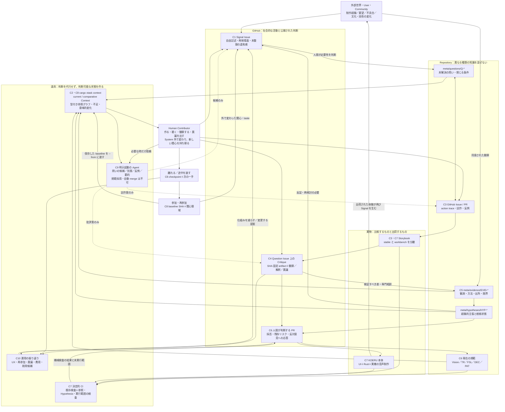

# KOERU Design System Research & Reference Architecture
## 創作実践を引き継ぎ、作り替えるための社会技術基盤

> [!IMPORTANT]
> **この文書は調査報告兼 Reference Architecture であり、KOERU の規範の正本ではない。**
> ここにある `shall` 相当の提案、時間・件数などの運用値、directory / schema / command の例は、
> 採用前の設計候補である。実際に採用する規範は `TR-*`、FSL、`DEC-*`、将来の `PAT-*`、
> およびそれらから参照される実装・policy に置く。
> この文書と正本が食い違う場合、この文書を更新するか、食い違い自体を Question として扱う。
> **この文書を引用しただけでは、提案が採用済みになったことを意味しない。**

### この文書が保持するもの

- なぜこの Architecture を候補とするのかという調査・推論・反証条件
- 各 mechanism の Execution Contract と、repository 上へ落とす具体案
- 採用前の schema / CLI / workflow の例
- 実際に採用された正本への参照

正本そのものは重複して保持しない。

## 1. KOERU の根本的な Design Problem

**KOERU の問題は、デザインの規則が足りないことではない。受け継いだ判断を正確に実装する経路に比べて、その判断を生んだ世界の捉え方を、実際の創作経験から疑い直す経路が弱いことである。**

もう少し具体的に言うと、次の二つを両立させる必要がある。

> 文脈を受け継ぐことで、以前の失敗を繰り返さずに作れる。  
> 文脈を受け継いだからこそ、その文脈では説明できない現実を発見し、作り替えられる。

これは、長期在籍者の知識を文書化するだけでは解決しない。新しい Contributor が既存の言葉を使えるようになっても、その言葉が見落としているものを指摘できなければ、継承したのは設計能力ではなく適応能力だからだ。

また、離脱・復帰・途中の引き継ぎを通常状態とする以上、連続的な参加や元作者の記憶に依存することもできない。これは今回の設計で守る前提とする。

以下では、この問題設定を**リポジトリの観察から導いた診断仮説**として扱う。現在の UX が微妙に感じられる原因を、利用者調査によって確定したという意味ではない。

### 調査の範囲と限界

リポジトリは、調査時のコミット

```text
489d3a57fccb68103b0b50d0b5cf5d11beda2ad3
```

に固定して確認した。指定された文書群、`meta` の記録、FSL、Contributor 向け規約、Agent Skills、GitHub workflow、`xtask`、Storybook 設定、および代表的な UI・style・story のソースを調べた。

**今回行ったのはソースと記録の分析であり、KOERU の実機操作、CI の再実行、利用者セッションではない。** 以下の「現状の観察」「外部研究の知見」「新しい設計提案」は区別して記す。

### 1.1 現在の KOERU は、すでに重要な問題を理解している

| 観察したもの | 継承すべき強み | 次に解くべき問題 |
|---|---|---|
| `meta/README.md`、`specs/README.md` | 要件・判断・未知・証拠・形式契約を分離している。FSL の整合性が製品意図の正しさを保証しないことも明記している。 | 参照が解決することと、その参照が現在の判断に十分であることは別。 |
| `DEC-PLT-025`、`Q-PLT-005` | 選択肢、失敗案、残存リスク、撤回条件が残されている。 | 撤回条件を誰が、どの活動で観測するかが、記録そのものほど強く実装されていない。 |
| UX reports、`EVID-UX-004` | 調査の不足を隠さず `Assumption` としている。 | 外部事例の観察から、KOERU の利用者の意味理解・愛着・楽しさへ進む橋が必要。 |
| `verify-koeru`、Storybook、CI | 機械で検査できるものを自動化し、実音声でしか分からないことも区別している。 | 実行されなかった検証、mock 上の検証、実機での観察を、判断時にさらに明確に分離する必要がある。 |
| `cargo xtask touched` | 変更が引用する契約と撤回条件をレビュー前に出す。参照のない変更も明示する。 | 変更箇所の引用抽出から、反証・後継判断・関連する未知まで辿れる文脈取得へ拡張できる。 |

これらの強みは捨てない。特に、KOERU を「形式検証を UX 検証と混同しているプロジェクト」と診断するのは誤りである。既存資料は、その境界をすでに認識している。

### 1.2 問題は、推論の途中にある選択が「当然の制約」へ変わること

三つの具体例がある。

**第一に、操作数と理解可能性は別である。**  
`first-run.fsl` は、起動・名前・方式・マイクという経路と、先に挟まない関門をモデル化している。しかし「方式を選ぶ」という一操作を、初めての人が意味を理解して行えるかは、このモデルの検査対象ではない。これは仕様の欠陥ではなく、別種の問いが残っているということである。

**第二に、オブジェクトの連続性から、唯一の画面構成は導けない。**  
`competitive-structure.md` の重要な発見は、工程ごとに画面を分けてもオブジェクトを分断しないことにある。したがって「同じ音源・テイク・oto を保ったまま、作業目的に応じて異なる入口を持つ」という設計も探索対象にできる。オブジェクト中心設計を採ることと、すべての工程的なナビゲーションを排除することは同義ではない。後半は、この資料からの私の設計上の推論である。

**第三に、視覚的な比喩が、作業の条件を逆に規定しうる。**  
`DEC-PLT-025` は「育っていく声」を中心に置き、環の閉じ方を被覆と結び付ける。その一方で、外径の違いが優劣に見えるリスクや、「環が閉じること」と完成条件を一致させるための判断も記録している。ここでは、比喩が体験を助けているのか、比喩を成立させるために体験を組み替えているのかを、区別して問える必要がある。現時点で、後者だから悪いと断定はしない。

したがって必要なのは、さらに強い統一規則ではない。

**「何を大事にするか」「何が起きると予想するか」「何を実際に観測したか」「何を当面採用するか」を分け、その間を往復できる仕組みである。**

---

## 2. 外部調査から得た重要な対立

調査は、単一の Design System の方法論を移植するためではなく、異なる実践が何を最適化し、何を取りこぼすかを比較するために行った。以下は網羅的な systematic review ではなく、原論文・著者公開資料・公式運用資料を中心とする横断的な調査である。

### 2.1 方法論を、その目的から読み直す

| 知的伝統・実践 | 主に最適化していること | KOERU にそのまま持ち込むと失うもの | 採用する部分 |
|---|---|---|---|
| **Design System の contribution model** | GOV.UK では、複数チームにとっての有用性、独自性、使いやすさ、一貫性、適用可能性を審査する。 | 単一製品の探索段階で、すべての案に広範な再利用性を求めると、その製品固有の表現を早く一般化しすぎる。 | 適用範囲と検証済み範囲を明記する。ただし、探索中の案に部品ライブラリの公開基準を課さない。([design-system.service.gov.uk](https://design-system.service.gov.uk/community/contribution-criteria/)) |
| **Design Rationale／QOC** | Questions・Options・Criteria を結び、設計空間と判断理由を扱えるようにする。選択肢の発見から問いが変わることも含む。 | 最初から良い問い・完全な選択肢・明確な基準を要求すると、曖昧な違和感が入れなくなる。 | 問いと案を相互に更新する。最初の Signal は非形式的でよい。([projects.buckinghamshum.net](https://projects.buckinghamshum.net/docs/SBS-DSA-1993.pdf)) |
| **Incremental Formalization** | Shipman／McCall は、実践中の非形式的な情報を、必要に応じて構造化することを扱う。 | すべてを最初から schema に入れる設計は、記録のための作業を増やし、参加者が持つ未整理な知識を落とす。 | Issue の自由記述から始め、後続の判断に必要になった情報だけを `meta` に昇格する。([people.engr.tamu.edu](https://people.engr.tamu.edu/shipman/chi94-hos/chi94hos_abstract.html)) |
| **Cognitive Apprenticeship と episodic OSS participation** | 前者は、実演・足場かけ・言語化・省察・支援の縮小による実践能力の獲得。後者の研究は、断続的・多様な参加の価値を示す。 | 学習者を常勤の専門家へ育成する metaphor を、そのまま自発的な OSS 参加へ押し付けてしまう。 | 実物を一緒に作る支援は用意するが、専門家化・長期在籍・中心メンバー化を成功条件にしない。([aft.org](https://www.aft.org/ae/winter1991/collins_brown_holum)) |
| **Boundary Objects／Distributed Cognition** | 異なる立場の協働と、人・道具・環境を横断する認知を扱う。 | 全員が同じ解釈を持つことを前提にすると、協働のための共有物が、思想を統一する装置になる。 | ID と artifact の同一性は共有しつつ、解釈・関心・表現は複数残せるようにする。schema があるだけで協働が成立するとは考えない。([doi.org](https://doi.org/10.1177/030631289019003001)) |
| **Parallel Prototyping** | Dow らの実験では、広告制作における並行試作が、逐次試作に比べ成果や多様性などを改善した。 | 「必ず三案」「並べれば創造的」という儀式に変わりうる。広告制作の結果を音声制作 UX 全体へ一般化できない。 | 評価を急いで一案へ集中せず、異なる仮説を表す対照を作る。案数ではなく差の意味を記録する。([doi.org](https://doi.org/10.1145/1879831.1879836)) |
| **Professional Critique と rough consensus** | Lerman の Critical Response Process は作り手の主体性を守る対話を設計する。RFC 7282 は票数より具体的な異議の検討を重視する。 | 作り手の許可を絶対化すると、利用者への害を指摘できない。一方、合意を重くすると小規模 OSS が停止する。 | 好みの批評と必須の安全指摘を分け、異議への応答を残す。全員一致や会議参加を権威にしない。([lizlerman.com](https://lizlerman.com/critical-response-process/)) |

実運用の失敗からも学べる。Rust の RFC 運用では、全員の反応を必要とする仕組みが、能動的な反対ではなく不在によって停滞する問題に対して調整された。KOERU でも、沈黙を同意とみなすことと、全員の応答を待ち続けることの両方を避ける必要がある。([internals.rust-lang.org](https://internals.rust-lang.org/t/psa-tweaks-to-fcp-process/6775))

### 2.2 AI の「創造性支援」と「多様性の縮小」は両立する

Doshi／Hauser の短編創作実験では、生成 AI のアイデアが個人の作品評価を高める一方、作品群の多様性が低くなる傾向が示された。別の CHI 2024 の視覚的アイデア生成実験では、AI 画像を使った条件で初期例への fixation が強く、案の流暢性・多様性・独創性が低かった。課題も方法も異なるため、同じ効果の完全な追試ではないが、**個人の出力品質と、集団の探索範囲を別に見る必要がある**という設計上の懸念を支持する。([doi.org](https://doi.org/10.1126/sciadv.adn5290))

ここから「人間が先に考えれば必ず解決する」とまでは言えない。KOERU では、人間の初期案を AI 提示前に少し作る方法、異なる参照領域を使う方法、AI を反例探索へ回す方法を、**試すべき対策**として採用する。

### 2.3 Synthetic User は、一括して肯定も否定もしない

Park らの研究は、本人への詳細なインタビューに基づく agent が、一定の調査応答を再現できる可能性を示している。ただし、そこで報告された「85%」は、人間自身の再回答一致度に対する相対的な値であり、任意のユーザー行動を 85% 正しく予測できるという意味ではない。([arxiv.org](https://arxiv.org/abs/2411.10109))

一方、2026年7月公開・査読中の *When Synthetic Users Fail* は、人口統計的なプロフィールから生成した調査応答について、個人・集団差の再現に大きな限界を報告している。これは、本人の詳細なデータで構成された agent をすべて否定する結果ではない。**何で接地した agent が、何を予測するのかを分けるべき**ということである。([arxiv.org](https://arxiv.org/html/2607.26348v1))

KOERU には、利用者の音声制作行動・意味理解・感情について、そのような予測能力を校正したデータがない。したがって、本仕様では synthetic user の発言を、ユーザー観察として扱わない。

### 2.4 「人間を最後に入れる」だけでも不十分

人間と AI の組合せについてのメタ分析では、人間単独に対する改善と、人間・AI のうち優れた方を上回る相乗効果は区別される。平均的に後者が成立するわけではなく、課題によって結果が異なる。したがって、Human approval gate を付けたこと自体を品質保証とみなさない。([doi.org](https://doi.org/10.1038/s41562-024-02024-1))

### 2.4.1 Community of Practice を権力から中立な学習装置とみなさない

Situated learning / Community of Practice は、KOERU の「実践へ参加しながら学ぶ」という構想に
重要な示唆を与える。一方で、その語彙をそのまま肯定的な community model として採用しない。

Contu & Willmott (2003) は、situated learning が本来含んでいた power relations への視点が、
企業が Community of Practice を管理目標へ利用する過程で弱められうると批判している。
Fox (2000) も CoP theory を power relations の観点から再検討し、formal / canonical な組織像だけで
learning を理解することへ疑問を向ける。Roberts (2006) は knowledge management における CoP
approach の limits を整理している。

KOERU では、この批判を次の architecture requirement に変換する。

- Context mastery を発言権の前提にしない。知らない人の違和感も Signal として受ける。
- 古参が Canon を説明できることを veto authority に変えない。
- newcomer が周辺参加から中心へ進むことを success path と強制しない。
- Canon に反する proposal だけ説明コストが高くなっていないか C10 で観測する。
- Studio role を固定階層にせず、Reader / Contrarian / Context Keeper 等を輪番可能にする。
- Community の語彙に馴染むことと、design capability を区別する。

この注意は「権力をなくせる」という主張ではない。
誰が merge / release / rights-related decision を担うかという実際の権限は明示しつつ、
learning system がその権限差を不可視化・正当化しないことを目指す。

参照:

- Contu & Willmott (2003), *Re-Embedding Situatedness: The Importance of Power Relations in Learning Theory*, Organization Science 14(3):283–296. https://doi.org/10.1287/orsc.14.3.283.15167
- Fox (2000), *Communities Of Practice, Foucault And Actor-Network Theory*, Journal of Management Studies 37(6):853–868. https://doi.org/10.1111/1467-6486.00207
- Roberts (2006), *Limits to Communities of Practice*, Journal of Management Studies 43(3):623–639. https://doi.org/10.1111/j.1467-6486.2006.00618.x

### 2.5 Research evidence matrix

外部研究は「引用したから正しい」という authority として使わない。
設計へ転用するとき、研究が実際に観察した対象と KOERU へ持ち込めない範囲を同時に残す。

| Source | 種類 / 対象 | この Architecture が借りるもの | KOERU への転用限界 | Status |
|---|---|---|---|---|
| Contu & Willmott; Fox; Roberts, critiques of Communities of Practice | organizational learning / power | Context learning can reproduce authority, exclusion, and managerial goals | KOERU is volunteer OSS, not the organizations studied; use as an adversarial lens, not a predicted outcome | peer-reviewed critical studies |
| MacLean et al., QOC / Design Space Analysis | design rationale / software design | Question・Option・Criteria を分け、問いと案が相互に変化する見方 | KOERU の創作 UX を実証した研究ではない | academic / foundational |
| Shipman & McCall, Incremental Formalization | HCI / design information management | informal な材料を必要時だけ形式化する原則 | GitHub OSS での運用コストは KOERU で観測が必要 | peer-reviewed HCI |
| Collins, Brown & Newman / Cognitive Apprenticeship | learning / apprenticeship | modeling、coaching、articulation、reflection、exploration | volunteer OSS の長期在籍を前提にしてはいけない | academic / educational theory |
| Star & Griesemer, Boundary Objects | sociology of science | 同じ artifact を異なる立場が異なる解釈で共有できる見方 | schema があるだけで協働が成立するとは言えない | peer-reviewed |
| Dow et al., Parallel Prototyping | experimental HCI / design task | 早期収束を避け、対照を並行して作る価値 | 広告制作課題から KOERU UX 全体へ効果量を一般化しない | peer-reviewed experiment |
| Doshi & Hauser, generative AI and creativity | creative writing experiment | 個人品質と集団 diversity を分けて考える | UI / 音声制作で同じ効果を仮定しない | peer-reviewed experiment |
| CHI 2024 visual ideation study | visual ideation experiment | AI 例による fixation を exploration risk として扱う | task / model / participant 条件に依存 | peer-reviewed conference |
| Park et al., generative agents | interview-grounded agent simulation | grounding の種類によって simulation capability が変わる | KOERU の利用者代理として校正されていない | preprint / empirical |
| Human-AI combination meta-analysis | multiple task families | human approval を synergy と同一視しない | task heterogeneity が大きく、KOERU 固有効果は未測定 | peer-reviewed meta-analysis |
| GOV.UK contribution criteria | production design-system practice | reuse scope と contribution boundary を明示する | multi-team government service と単一 creative tool は目的が違う | practitioner / official |
| Rust RFC / FCP operations | OSS governance practice | silence、rough consensus、async governance の運用失敗から学ぶ | Rust community の規模・権限構造をそのまま移植しない | practitioner / primary record |
| W3C evaluation guidance | accessibility standards practice | automation と human evaluation の能力を区別する | conformance だけで creative experience は評価できない | standards / official |

各研究を `EVID-*` に移すのは、その研究が実際の KOERU Decision の根拠として参照されるときだけでよい。
この表は research map であり、外部論文を KOERU の user evidence に昇格させるものではない。

主要参照先:

- MacLean et al., *Questions, Options, and Criteria: Elements of Design Space Analysis*: https://projects.buckinghamshum.net/docs/SBS-DSA-1993.pdf
- Shipman & McCall, *Supporting Knowledge-Base Evolution with Incremental Formalization*: https://people.engr.tamu.edu/shipman/chi94-hos/chi94hos_abstract.html
- Dow et al., *Parallel Prototyping Leads to Better Design Results*: https://doi.org/10.1145/1879831.1879836
- Doshi & Hauser, *Generative AI enhances individual creativity but reduces the collective diversity of novel content*: https://doi.org/10.1126/sciadv.adn5290
- Human-AI meta-analysis: https://doi.org/10.1038/s41562-024-02024-1
- Star & Griesemer, Boundary Objects: https://doi.org/10.1177/030631289019003001
- GOV.UK Design System contribution criteria: https://design-system.service.gov.uk/community/contribution-criteria/
- W3C accessibility evaluation overview: https://www.w3.org/WAI/test-evaluate/

---

## 3. 採用する Design System 観

### 3.1 「デザイナーを作る道具」は、目的としては採用しない

この思想には、カタログを配るだけでは設計実践が育たないという重要な指摘がある。しかし、KOERU の最上位目的にはしない。

理由は、育成そのものが目的化すると、次の誤認が起こりやすいからだ。

| 誤認 | 本仕様での置き換え |
|---|---|
| 既存の語彙を使える人が、設計できる人である | 未知の状況で、判断の限界と必要な証拠を見つけられることを見る |
| 全員が同じ taste を持つことが learning である | 異なる taste が、具体的な artifact を介して対話できることを見る |
| Context を読めば specialist expertise を代替できる | 専門的な実演・相談・検査を、必要な問いに接続する |
| Contributor は徐々に中心メンバーになるべきだ | 一回の発見、一つの修正、短い再参加でも成立させる |
| System に沿った説明ができれば良いデザインだ | 実際の創作体験が変わったか、別に確かめる |

**Design System は、デザイナーという人材を生産する装置ではなく、異なる人が良い創作判断に参加し、その判断を修正・継承できる条件を整える基盤とする。**

学習は top-level objective ではない。しかし、**実践へ参加した結果として contributor の design capability が育つことは system requirement とする。**
Product quality と learning を別プロジェクトに分けない。現在の UI を改善する仕事そのものが、
過去判断・反例・比較・批評・Probe を通じて次の Contributor の curriculum になるようにする。

ここで育てたいのは KOERU 用語への適応ではなく、観察を解釈から分ける、対照案を作る、
反例を探す、何なら考えを変えるか言える、分からないことを分からないまま扱う、
必要なら Canon を疑う、といった行動である。

個人の maturity score や「卒業」は作らない。学習が成立しているかは、
System が newcomer にも判断参加の機会を与え、元作者なしで reasoning を再構成できるかという
product-development capability として観測する。

### 3.2 二つの状態を、絶対に混ぜない

本仕様の中心は、次の分離である。

```text
採用状態：今の KOERU は、何をすることに合意しているか
根拠状態：その判断が期待する効果について、何が分かっているか
```

したがって、次の状態は正常である。

```text
Decision: accepted
Hypothesis: untested
Release: 限定的・可逆的な範囲で許可
```

逆に、次もありうる。

```text
Hypothesis: 特定条件では支持された
Decision: 不採用
理由: KOERU が守る価値や運用費用と合わない
```

「支持されたから採用しなければならない」「採用したから検証済みである」のどちらも禁止する。

---

## 4. 全体 Architecture

実行単位は、次の十個に限定する。後述の CLI、GitHub 操作、Agent、保存規則は、すべてこのいずれかに属する。

| ID | 実行単位 |
|---|---|
| C1 | Signal の受け入れと問いへの変換 |
| C2 | 決定的な Context の組み立て |
| C3 | 異なる体験案の探索 |
| C4 | Critique・共同制作・実演 |
| C5 | Evidence の取得と専門相談 |
| C6 | 判断・規範化・異議申し立て |
| C7 | 実装・検査・リリース・実世界への接続 |
| C8 | 中断・引き継ぎ・再参加 |
| C9 | 権限を限定した Agent 実行 |
| C10 | System 自身の観測・縮小・修正 |

### 思想と実装を統合した一枚図



この図で重要なのは、出荷までの一本道ではないことである。

**新しい Evidence は判断を再開させ、試作は問いを変え、復帰した人は以前の世界へ戻るだけでなく、外で得た新しい見方を持ち込む。**

---

## 5. Repository と知識 object の設計

### 5.1 正本を増殖させない

現在の `TR`・`DEC`・`Q`・`EVID`・FSL は維持する。新しい恒久的な知識 object は、原則として二種類だけ追加する。

| Object | 役割 | 規範か |
|---|---|---|
| `TR-*` | 製品が満たす条件 | はい |
| FSL の ID | 状態・遷移・不変条件などの形式契約 | はい。ただしモデルのスコープ内 |
| `DEC-*` | 選択、理由、採否、覆す条件 | 採用された判断は規範 |
| `Q-*` | 未解決の問い、検討中の選択肢、閉じる条件 | いいえ |
| `EVID-*` | 観測・調査・測定の出所と結果 | いいえ |
| **`HYP-*`：追加** | 検証対象となる経験的主張と、その根拠状態 | いいえ |
| **`PAT-*`：追加** | 適用条件と不適用条件を持つ、再利用可能な設計実践 | 採用された範囲で規範 |

`CMP-*` は流用しない。現状の `CMP` は依存部品・ライセンス監査の台帳であり、UI component の登録簿とは役割が違う。

Signal、探索案、Blind Read、Critique、生成した Context、Agent の各発言については、新しい恒久的な登録簿を作らない。これらは Issue、PR、commit、CI artifact、branch 上の一時 artifact に残す。

### 5.1.1 PR / Issue は event log、meta は compiled memory

GitHub 上の Issue / PR と `meta/` は、同じ過程を二重保存するためのものではない。

> **PR は議論を残す。meta は議論の結果として、プロジェクトが今後も覚えておく必要があることだけを残す。**

Issue / PR は、提案、比較、却下案、Blind Read、Critique、Agent 出力、途中の screenshot、review、diff といった**変更イベントの履歴**を持つ。  
`meta/` は、その履歴から未来の判断へ持ち越す必要がある**現在の semantic state**だけを持つ。

判断基準は、「この PR を知らない未来の Contributor が、それでも発見できなければ困るか」である。

| 内容 | 原則の保存先 |
|---|---|
| 一回限りの没案、途中の比較、Agent の発言 | Issue / PR |
| Blind Read の生コメント、Critique の往復 | Issue / PR |
| branch 上だけで使う比較 Story / screenshot | PR と対象 commit |
| 次の変更へ持ち越す未解決の未知 | `Q-*` |
| 将来の Decision が依存する経験的予測 | `HYP-*` |
| 別の判断でも再利用する価値がある観測 | `EVID-*` |
| 現在の実装を拘束する採用判断 | `DEC-*` |
| 複数箇所で再利用する設計実践 | `PAT-*` |

meta object から元 Issue / PR / commit への provenance を参照してよいが、conversation 全文を Markdown に複製しない。GitHub から別 forge へ移る場合は provenance/history の移行を行い、lock-in 回避のために全議論を二重管理することはしない。

一方、外部観測そのものが失われると将来の判断を再構成できない場合は、`EVID-*` に必要な観測結果・条件・限界を保存し、元資料への locator を併記する。

### 5.2 規範の種類ごとに、正本を明示する

| 内容 | 正本 |
|---|---|
| 製品の目的・非目標・創作観 | `docs/product-vision.md` |
| 満たすべき条件 | `meta/requirements/` |
| 形式化した契約 | `specs/` |
| 採用の理由・適用範囲・撤回条件 | `meta/decisions/` |
| 再利用する設計実践 | `meta/patterns/` |
| 実際の色値・寸法・component API | CSS・TypeScript・Rust の実装 |
| 運用経路・費用上限・Agent 権限 | `design/policy.toml` とそれを実行する workflow |
| 学習用の説明・手順・索引 | `docs/design/guide.md`。正本への参照と projection |

ここでは、現状の「`docs` に規範を書かない」という原則に対し、**Product Vision の目的・非目標は例外として正本である**ことを明文化する。現状でも Vision は確定方針として扱われているため、その実態を曖昧なままにしない。

ただし、Vision と形式契約が食い違ったときに、機械的な優先順位で問題を消してはいけない。「モデルが意図を取り違えたのか」「意図を改めるのか」を Question として扱う。

### 5.2.1 現行 `direction.md` を authority ごとに分解する

現在の UX direction は、重要な知識を一箇所に集約した結果として、異なる authority の命題が
同じ文章レベルに並んでいる。理想形では、これを一括して「Design Guideline」として昇格しない。

各命題を少なくとも次へ分類する。

| 種類 | 例 | 将来の置き場所 |
|---|---|---|
| **Product promise / durable constraint** | Own your voice、アクセシビリティを既定で満たす | Vision / TR / FSL / DEC |
| **Adopted design decision** | 特定の metaphor、情報構造を現在採用する理由 | DEC |
| **Empirical hypothesis** | 「この表現なら未完成を不足ではなく途中として理解する」 | HYP + Probe + EVID |
| **Reusable pattern** | 特定条件で再利用する interaction / language practice | PAT |
| **Aesthetic authorship** | 現時点で選ぶ tone / composition | DEC または artifact。疑似 Evidence を作らない |
| **Implementation convention** | component API、CSS token、focus 実装 | code / checked convention |
| **Example** | 現在の story / screenshot | Storybook / artifact |

たとえば「Own your voice」と「道具は動かない」と「色相を限定する」を同じ強さの原則として扱わない。
前者は product-level promise になりうるが、後二者は反証可能な design choice / hypothesis である。

最終的な Human-readable guide は、この分類された正本を projection して読む。
`direction.md` は移行中の背景・設計史として保持してもよいが、そこに書かれているだけで
新しい規範が生まれる状態は終わらせる。

### 5.3 ディレクトリ構成

以下は提案後の構成であり、新しいファイルやコマンドをすでに追加したという意味ではない。

```text
docs/
  product-vision.md                 # 目的・非目標の正本
  reports/ux/                       # 調査の説明・背景
  design/
    guide.md                        # 学習用。規範は ID で参照

meta/
  requirements/                     # 既存
  decisions/                        # 既存
  questions/                        # 既存。未解決の問いと閉じる条件
  evidence/                         # 既存。方法・観測範囲を拡張
  hypotheses/                       # 新規：検証可能な経験的仮説
  patterns/                         # 新規：適用範囲付き実践

design/
  policy.toml                       # 経路・費用・保持・Agent の運用設定

crates/koeru-app/ui/
  design-links.toml                 # UI path / stable story と知識 ID の対応
  src/
    components/                     # 既存
    screens/                        # 既存
    styles/                         # 既存
  .storybook/
    main.ts                         # stable と明示起動の workbench を分離

xtask/src/
  main.rs                           # 既存コマンドと新コマンドの入口
  context.rs                        # index / traversal / current・comparative projection
  design.rs                         # schema・適用範囲・保持の検査

.agents/skills/
  ...既存の Skills...
  design-frame/SKILL.md
  design-explore/SKILL.md
  design-review/SKILL.md
  design-reentry/SKILL.md

.github/
  ISSUE_TEMPLATE/design-signal.yml
  PULL_REQUEST_TEMPLATE.md           # 既存に短い設計欄を追加
  workflows/
    ci.yml                          # 決定的検査を拡張
    design-assist.yml                # 必要になってから追加する任意の入口
```

探索中だけ必要な比較 Story や prototype は、PR branch 上で `src/experiments/<issue-or-q>/` などに置いてよい。ただし**過程の保存を目的に main へ merge しない**。採用後も regression fixture・比較教材・再利用可能な artifact として価値がある場合だけ stable な置き場所へ昇格し、それ以外の履歴は Issue / PR が持つ。


`design-links.toml` は規則の複製ではない。「この screen／stable story は何の文脈で読むか」という対応だけを持つ。実際の story export の存在は、ビルド時に検査する。PR 中だけの experiment は、この恒久 mapping に登録しない。

### 5.4 Schema の最小拡張

#### Hypothesis

Hypothesis は、**まだ世界によって確かめる余地があり、Design Decision が依存しうる経験的予測**を表す。誰かの意見を集める「主張台帳」ではない。

以下の ID は形式例であり、未予約である。実装時は `next-id` を拡張・使用して正式に採番する。`Q-UX-nnn` の `nnn` は採番前のプレースホルダで、`check-references` が ID として拾わない形にしている。

```toml
schema = "design-hypothesis"
id = "HYP-UX-001"
question = "Q-UX-nnn"

hypothesis_kind = "semantic-comprehension"
statement = """
初めて使う人が、環の外径の違いを音源の優劣ではなく、
録れた音の量の違いとして説明できる。
"""
scope = """
音源一覧。説明を先に与えない初回接触。
被覆の異なる複数音源を並べた状態。
"""

assessment = "untested"
supporting_evidence = []
contradicting_evidence = []

limits = [
  "実利用者による観察はまだない",
  "SVG の描画テストは意味理解の証拠ではない",
]
```

Hypothesis に「採用／不採用」を持たせない。Decision に「真／偽」を持たせない。Hypothesis は Evidence によって支持・反証・scope 限定されても同じ ID のまま扱い、`untested` / `supported` / `contradicted` / `superseded` などの assessment を更新する。

既存の `confidence = Fact / Assumption / Unknown / Risk` の意味も、黙って変更しない。新しい Hypothesis の評価は、既存 Evidence の確度表記とは別の軸にする。

#### Question と探索過程を分離する

Question は durable な未知だけを持つ。既存の `why_it_matters`、`how_to_close`、影響先の relation を中心とし、**探索中の alternatives、action trace、artifact path、作業時間の予算を Question の第二正本として保存しない。**

探索過程は Question に対応する GitHub Issue / PR で行う。

```text
Issue / PR
├── current frame
├── alternatives / action trace
├── Blind Read / Critique
├── temporary Story / screenshot / commit SHA
├── Agent output
└── rejected alternatives
```

そこから未来にも必要なものだけを昇格する。

```text
未解決の未知                    → Q-*
将来の判断が依存する経験的予測  → HYP-*
再利用価値のある観測            → EVID-*
採用した選択                    → DEC-*
再利用する実践                  → PAT-*
```

PR 側は関連 ID を参照し、meta object 側は必要なら元 Issue / PR / commit の provenance を持つ。文章を両方へコピーしない。

#### Evidence と Pattern

| Object | 追加する主要情報 |
|---|---|
| Evidence | 方法、対象 Hypothesis、観測した revision、実行状態、参加者との関係、観測条件、元資料の locator、同一起源を表す `origin_group`、派生元、限界、公開可否 |
| Pattern | `applies_when`、`must_not_apply_when`、規則本文、例、反例、関連する TR、採用した DEC、検査先、撤回条件 |

実施予定は Evidence にしない。調査計画は Question に置き、実際に観測してから Evidence を作る。

また、現在の `xtask` は schema・配置・必須項目などを明示的に扱っている。新しい directory や nested table を置くだけでは動かない。新 schema、ID prefix、参照フィールド、入れ子の許可、旧形式との互換性を、検査実装へ同時に登録する。

---

# 6. C1 — Signal の受け入れと問いへの変換

### Execution Contract

**Purpose：** 未整理な経験を失わず、判断が必要なものだけを問いに変える。  
**Trigger：** feedback、bug、要望、実機での違和感、新しい Evidence、外部環境の変化、説明できなかった箇所、Contributor がプロジェクト外で得た経験や taste の変化。

**Input：** 自由記述、操作場面、任意の screenshot／録画、対象 revision、関連 Issue。既存 KOERU の語彙へ翻訳できていない外部経験もそのまま受け付ける。  
**Transformation：** 場面を再構成し、既知の不具合・既存 Pattern の適用・未解決の設計判断を切り分ける。重複をまとめる。

**Output：** 通常の修正 Issue、既存 Question への追加、または新しい Question の案。  
**Persistence：** Signal は GitHub Issue。昇格した問いだけを `meta/questions/` に保存。

**Actor：** 誰でも報告できる。Agent は整理案を出せる。問いへの昇格と優先度は人間が判断する。  
**Interaction model：** 非同期。Issue Form と通常のコメントを使う。

**Exit condition：** 「修正へ」「既存の問いへ」「新しい問いへ」「保留」「対応しない」のいずれかと理由が記録される。  
**Failure mode：** 全 Signal を formal record にして爆発する、曖昧な感覚を記述不足として捨てる、Agent が誤って問題を再定義する。

**Downstream：** C2。軽微な修正なら C7 へ直接進む。前提の争いなら C6 に接続する。

### 6.1 Signal と Question は違う

```text
Signal:
「この画面、なんか微妙」

Question 候補:
「初回の録音開始を妨げているのは、操作の発見か、
 声の環に割り当てた注意の大きさか、それ以外か」
```

Signal の段階では、報告者に良い問いを要求しない。最初の Form は次の三つで十分である。

| 欄 | 必須性 |
|---|---|
| 何をしていたか | 分かる範囲で |
| 何が起きた／どう感じたか | 必須 |
| 本来どうなってほしかったか | 任意 |

「なんとなく違う」だけでも受け付ける。その後、担当者が一つの場面まで具体化する。

具体化では、**観察・解釈・期待を分離する**。

```text
観察：録音を始める前に、画面を上下に見直した。
解釈：次に押す場所が分からなかったのかもしれない。
期待：音源を開いたら、次の創作行為へ入れる。
```

解釈を、報告者の認知や感情についての確定事実に変換しない。

### 6.2 問いを作る threshold

| 経路 | 対象 | 必要なもの |
|---|---|---|
| **R0：再利用・修復** | 既存の適用範囲内の Pattern、明確な regression、意味や操作モデルを変えない修正 | 関連 ID、変更、必要な回帰検査。新 Question・探索・会議は不要 |
| **R1：可逆的な体験変更** | 操作の発見、文言理解、注意配分、既存 Pattern の範囲外への適用 | 一つの Question、区別したい仮説、比較 artifact、検証の限界 |
| **R2：前提・権利・不可逆性に関わる変更** | 製品原則、公開・同意、元音声の扱い、データ互換性、音源／oto の同一性など | Question、Decision、反対案、移行・撤回、必要な専門確認 |

コード差分の行数では分類しない。一行の文言でも「観測」を「評価」に変えれば R1／R2 になりうる。

また R0 / R1 / R2 を、人が直接選ぶラベルにはしない。
まず次の risk dimension を記述し、lane はその組合せから導く shorthand とする。

```text
reversibility       すぐ安全に戻せるか
rights_and_harm     権利・同意・データ損失・accessibility へ影響するか
evidence_gap        重要な効果がどの程度未検証か
interaction_novelty 既存 PAT / interaction model の範囲内か
blast_radius        何人・何画面・何形式へ広がるか
migration_cost      既存データ・workflow・学習を壊すか
```

これにより「これは R0 ですよね」という category negotiation ではなく、何が危険だから
深い経路が必要なのかを説明できる。lane の閾値は policy に置き、経験に応じて変えられる。

新しい問いは、少なくとも次を持つ。

> 何を決める必要があるか。  
> 答えが違うと、何を別に作るか。  
> 何が分かれば、次の行動へ進めるか。

Agent が自動的に Question を大量起票することはしない。候補は一回の依頼で少数に制限し、既存 Question への追加を優先する。

能動的な探索の同時数は `design/policy.toml` の `max_active_explorations` で制御する。Reference Architecture は値を固定しない。

---

# 7. C2 — 決定的な Context の組み立て

### Execution Contract

**Purpose：** 全文書の読破を要求せず、判断に必要な制約・理由・未知・反証を取り出す。  
**Trigger：** Issue 着手、PR review、探索開始、再参加、明示的な CLI 実行。

**Input：** ID、変更 path、Issue／PR の明示された root、対象 SHA、必要なら比較元 SHA。  
**Transformation：** 型付き参照グラフを決定的に辿り、重要情報を優先し、不足・古さ・未対応 path を表示する。

**Output：** Human 向け Markdown と Agent 向け JSON の Context。`--from` がある場合は現在状態と semantic change を同じ出力に含める。  
**Persistence：** 原則として生成物。ローカルまたは CI artifact。手書きの第二正本にしない。

**Actor：** deterministic program。Agent の要約は、その上に付ける任意の層。  
**Interaction model：** ローカル CLI。GitHub では同じ CLI の出力をコメント／artifact として渡す。

**Exit condition：** root・revision・取得経路・欠落が分かる Context を出す。比較時は `from` / `at` と、added・removed・changed・superseded・newly contradicted を区別する。重大な欠落時は「不完全」として終了する。  
**Failure mode：** グラフ外の現実を存在しないと扱う、参照を論理的な依存と誤認する、制約を要約で落とす。

**Downstream：** C3・C4・C5・C9。復帰では C8 と組み合わせる。

### 7.1 Graph の node と edge

Node は知識 ID、source path、story、GitHub Issue locator である。

Edge の意味を区別する。

| Edge | 意味 |
|---|---|
| `formalized_as` | TR のうち形式化した契約を FSL が持つ |
| `depends_on` | 明示的な依存 |
| `affects_*` | 変更時に関係を確認すべき対象。論理的含意とは限らない |
| `answers`／`resolved_by` | Question と Decision の対応 |
| `relies_on_hypotheses` | Decision が期待する経験的効果 |
| `assesses` | Evidence が評価した Hypothesis |
| `supersedes` | 判断の後継関係 |
| `decided_by` | Pattern の採用根拠 |
| `mentions` | コメントや文書で ID に言及しているだけ |
| `context_for` | UI path／story を読む入口となる ID |

**コードコメントで ID を引用していることを、そのコードが要件を満たす証明にはしない。**

既存の `touched` は変更 hunk 周辺の ID を抽出する。これを seed として使うが、完全な impact analysis と呼ばない。既存実装も、引用のない変更を別に示している。

### 7.2 Traversal

基本は、型付き edge を使った traversal とする。ただし **graph distance を relevance の代理にしない。**

まず root の種類ごとに semantic closure を必須取得する。

- normative ancestor：現在有効な安全・同意・元データ保護を含む上位制約
- supersession chain：直接関係する Decision / Pattern の現在有効な後継
- empirical dependency：Decision が `relies_on_hypotheses` で依存する Hypothesis
- contradiction closure：その Hypothesis の contradicting Evidence と scope mismatch
- open uncertainty：関連する未解決 Question と release blocker
- artifact closure：読むべき stable story / workbench / implementation
- broken edge：root の取得に失敗した参照、orphan、UNMAPPED path

`mentions` は原則として closure を拡張しない。必要なら presentation layer から参照候補として見る。

semantic closure を集めた後でだけ、探索用の周辺 context を token / item budget 付きで広げる。
五段先でも `supersedes → relies_on_hypotheses → contradicting_evidence` なら重要であり、
一段先でも単なる `mentions` なら通常は重要ではない。

一般の参照グラフには循環があってよい。`visited` 集合で止める。`supersedes` の循環は不正として検査する。

UI の変更に引用がない場合、`design-links.toml` から入口を補う。それでも対応が取れなければ、次を出す。

```text
UNMAPPED:
  crates/koeru-app/ui/src/...

この変更に関係する設計契約を特定できていません。
「関係する契約がない」という意味ではありません。
```

### 7.2.1 Context は一つの semantic projection とする

Context と comparative Context を別の architectural object として持たない。
どちらも、root と revision から同じ semantic closure を計算する **Context Compiler の view** である。

```text
C(root, revision)
  = その revision で判断に必要な semantic context

Context(root, at)
  = current view

Context(root, from, at)
  = current view
    + diff(C(root, from), C(root, at))
```

`from` がない場合は現在状態だけを返す。`from` がある場合は、**今どうなっているか**と
**以前から何が変わったか**を同じ出力で返す。

比較部分は Git の textual diff ではなく、semantic state の変化を表す。

```text
added
removed
changed
superseded
newly contradicted
question opened / closed
scope changed
unresolved mapping
```

これにより、PR review と re-entry は別機能ではなくなる。

```text
PR review:
  from = origin/main
  at   = HEAD

Re-entry:
  from = saved checkpoint
  at   = HEAD
```

違うのは baseline の意味だけであり、どちらも「二つの revision における判断可能な Context」を比較している。

Delta だけを独立表示すると、「何が変わったか」は分かっても「結局いま何が有効か」を復帰者自身が
再構築する必要がある。comparative Context は current state を必ず含め、この再構築コストを避ける。

内部実装では `build_context(root, revision)` と `compare_context(before, after)` を分けてもよい。
しかし user-facing command / concept は `context` 一つにする。実装 module を分けることを
architecture 上の概念分割へ持ち込まない。

### 7.2.2 Current semantic state と provenance を二層にする

Context は、通常まず「いま何を前提に判断するか」を返す。

```text
Level 1 — current semantic state
TR / FSL / Q / HYP / EVID / DEC / PAT
current implementation / stable story
```

Issue / PR の会話履歴は、既定では全文を Context に入れない。

```text
Level 2 — provenance / history
Issue
PR
review comment
commit
temporary experiment artifact
```

Level 2 は、「なぜこの Decision になったか」「meta の rationale だけでは異議や却下案を再構成できない」ときに source locator から辿る。これにより、復帰者へ過去の全会話を読ませずに現在状態を提示しつつ、短い meta 記述が歴史を美化・単純化した場合には元の議論へ戻れる。

Context compiler は GitHub conversation を semantic state に自動昇格させない。Issue に書かれた一意見が、引用された回数だけで Hypothesis / Evidence / Decision になることを防ぐ。

### 7.3 情報量の制御

Human 向けの先頭は、原則八項目前後の要約カードにする。

```text
1. 今回決めること
2. 現在守る制約
3. 現在案を選んだ理由
4. 別案と、以前採らなかった理由
5. 新しく弱まった前提
6. 未解決の問い
7. 見るべき artifact
8. 欠けている Context
```

詳細は折りたたみ相当の後段へ置く。Agent 向けは同じ情報を、ID・edge・source hash・取得理由付き JSON にする。

Token budget は情報を黙って消す権限ではない。必須制約だけで予算を超えたら、root を狭めるか、分割 Context を返す。**制約を省略して「準備完了」にしない。**

### 7.4 CLI

```bash
# 既存
cargo xtask touched origin/main

# current Context
cargo xtask context \
  --root DEC-PLT-025 \
  --at HEAD \
  --format md

# comparative Context: current state + semantic changes
cargo xtask context \
  --root DEC-PLT-025 \
  --from origin/main \
  --at HEAD \
  --format md

# Agent / tooling 向けも同じ計算モデル
cargo xtask context \
  --root DEC-PLT-025 \
  --from "$BASELINE_SHA" \
  --at HEAD \
  --format json
```

引数の意味は次に限定する。

```text
--at <revision>
  読みたい現在地点。

--from <revision>
  比較したい以前の地点。optional。
  指定した場合も current state を省略しない。
```

`--base` と `--to` は導入しない。比較の起点は `--from`、現在地点は常に `--at` とする。
PR では `--from origin/main --at HEAD`、再参加では保存 checkpoint を `--from` に渡す。

初版では `--view current|changes|both` のような mode も不要である。`--from` なしなら current、
`--from` ありなら current + changes を default とする。CI などで changes-only が本当に必要になった時点で
projection option を追加する。

head で制約を削除しただけで「現在の制約はなくなった」と扱わない。比較時は旧・新両方の
semantic closure の和集合を使い、削除・supersession・新しい反証を見失わない。

コア CLI はオフラインで動かす。Issue の取得は薄い adapter が行い、本文を source data として渡す。Issue 内の命令文を実行指示として扱わない。

---

# 8. C3 — 異なる体験案の探索

### Execution Contract

**Purpose：** 現在案の局所調整ではなく、異なる前提に立つ体験を比較可能にする。  
**Trigger：** R1／R2 の問い、既存案では説明できない反例、前提を覆す Evidence。

**Input：** Question、Context、守る制約、疑ってよい前提、利用場面、探索予算。  
**Transformation：** 前提と設計軸を分解し、異なる action trace を作り、識別可能な対照へ具体化する。

**Output：** 比較できる試作、予測する違い、未探索領域、次の検証方法。  
**Persistence：** 主な探索過程は Question の Issue / PR。比較 Story や prototype は branch-local でよく、過程を保存するためには merge しない。未来の判断が依存する Hypothesis、再利用する Evidence、採用した Decision／Pattern だけを meta へ昇格する。

**Actor：** Human、Agent、または両者の共同制作。作者性と Evidence authority は分離する。Agent が Concept prototype 全体を生成してもよいが、その生成物は利用者の支持や意味理解の証拠にはならない。  
**Interaction model：** ローカル制作と非同期共有。必要なら短い共同制作。

**Exit condition：** 次の検証で区別できる対照ができた、または予算到達により未探索を明記して終了する。  
**Failure mode：** 見た目だけ違う案、同じモデルの疑似的多様性、早すぎる順位付け、試作の完成度競争。

**Downstream：** C4・C5。問いが変わったら C1／Q の更新へ戻る。

### 8.0.1 作者性と証拠能力を分ける

Human が描いた案だから人間中心であり、Agent が描いた案だから弱い、とは扱わない。
Design Space で問うのは **誰が描いたかではなく、どの前提を変えた案か** である。

一方で artifact の作者性と、その artifact が持つ epistemic authority は別である。
Agent が高品質な prototype を作ることはできるが、その prototype が「利用者は理解する」
「愛着を持つ」と証言することはできない。Human が作った prototype も同様である。

したがって provenance は残すが、Human / AI を quality ranking には使わない。
共同制作では「AI が作った箇所」を逐行 attribution するより、どの入力・constraint・revision に
基づく artifact かを再構成できることを優先する。

### 8.1 何を変えれば「別の可能世界」になるか

最初に UI layout ではなく、体験の構成を分解する。

| 軸 | KOERU で考えられる対照 |
|---|---|
| 最初に何へ向かうか | 音源という存在／次の録音／歌わせたい曲 |
| 作業の単位 | フレーズ／音高×alias／目的曲に足りない音 |
| 反応が返る時点 | 録音確定時／試唱時／自分が求めた時 |
| 制作者が主導するもの | 次の行為の選択／お勧めされた行為の実行 |
| 見せる進捗 | 収録量／今できる表現／残っている作業 |
| 失敗を知らせる方法 | 数値のみ／要求時の解説／非評価的な通知 |

すべての組合せを作る必要はない。Question の答えを変えうる軸を選ぶ。

たとえば Voice 画面であれば、次の三つは、単なる配色違いではない。

**声の存在を中心にする案。** 作っている対象への関係を強くする。  
**次の創作行為を中心にする案。** 録音・調整・試唱の開始を明確にする。  
**歌わせたいものを中心にする案。** 目的曲と不足している材料を往復する。

ただし、三つ作ることが要件なのではない。現状維持と一つの新案で十分に問いを区別できるなら、それでよい。逆に十案あっても action trace と前提が同じなら、探索したとは扱わない。

### 8.1.1 Moodboard を Visual / Interaction Corpus へ拡張する

Design Space の質は、生成 operator だけでなく、何を材料として見たかに強く依存する。
現行 moodboard の価値は残しつつ、将来は製品単位の「好きな画面集」ではなく、
**状態と interaction pattern を比較できる corpus** として育てる。

収集単位の例:

```text
first run
empty
creation
recording
waiting
partial completion
error
recovery
completion
detail editing
return after interruption
```

各 reference には必要に応じて次の観察軸を付ける。

```text
primary actor / primary object
information density
chroma allocation
hierarchy
missing-state representation
progress model
tool / artifact separation
vocabulary exposure
motion semantics
recovery model
```

Corpus の目的は「多数派 UI」を決めることではない。
Agent は共通点だけでなく、**現在の KOERU の design boundary を壊す counterexample** を優先的に探す。
同じ reference は複数 Question から再利用できるが、「他製品がそうしている」は
KOERU の UX validity の Evidence にはならない。

第三者 artifact は license / terms を尊重し、repository に screenshot を再配布することを
Corpus の必須条件にしない。URL、観察メモ、取得日時、必要なら自作の構造スケッチで参照可能にする。

### 8.2 AI は「別案の数」より「前提の差」を作る

Agent への依頼は、次のように分ける。

```text
類推：
  音声編集アプリ以外で、作るものと作業を往復する仕組みを探す。

反転：
  「中央には声が常駐する」を外したら、何を失い、何を得るか。

反例：
  現在案が自然に見えなくなる制作状況を挙げる。

制約変形：
  データ同一性・元音声保護を維持したまま、
  注意配分や操作の順番だけを変える。

削除：
  新しい機能を足さず、一つの表現を消したらどうなるか。
```

複数 Agent を使うなら、性格を変えるのではなく、**入力する資料・担当する反例・探索する領域**を変える。同じ model に「革新的な人」「保守的な人」を演じさせたことを、独立した見解の数として数えない。

人間が AI を見る前に短い案を作る方法は推奨するが、参加資格にはしない。手描きが難しい人は action trace や音声による説明でもよい。

### 8.2.1 Design Space は隔離した exploration lane から合流させる

一つの Agent に「案をたくさん出して」と頼むだけでは、同じ basin の表層 variation が増えやすい。
そこで、必要な Question では入力文脈と探索 operator を意図的に変えた lane を並列に使う。
重要なのは persona を演じ分けることではなく、**見せる情報と探索する方向を変えること**である。

| Lane | 与える Context | 役割 |
|---|---|---|
| **Canon-aware** | Product Context + 現 Canon + Evidence | 現在の学習を最大限使って改善する |
| **Constraint-only** | Promise / TR / hard constraint。現 direction / PAT は隠す | 既存解へ引かれず、同じ制約から別の構造を作る |
| **Contrarian** | 現 Canon + 「一つを反転せよ」 | Canon が成立しない条件と逆側の価値を探す |
| **Analogy Scout** | Question と構造だけ | 隣接領域・別 craft・反例から design move を輸入する |
| **Human seed** | AI の候補を見る前の短い初期案 | 先行生成物による fixation を避けるための独立 seed |

すべてを毎回走らせない。Question の重要度と探索予算で選ぶ。
複数 lane を使う場合、**初回生成中は互いの出力を見せず、最後に merge / compare する**。
同じ model を五人格にしただけなら独立した五案とは数えない。

Human seed は参加資格ではない。何も思いつかなければ空でもよい。
目的は人間優位を証明することではなく、AI の最初の framing が探索空間全体を決めることを避けることである。

### 8.2.2 Concept の distinctness を監査する

複数案があることと、複数の可能世界を探索したことは同じではない。
探索 artifact は、少なくとも次の dimension について baseline との差を記述できるようにする。

```text
primary object
temporal model
control locus
navigation model
information hierarchy
```

配色、radius、spacing、copy だけを変え、上の dimension と action trace がほぼ同じなら
`concept` ではなく `variation` として扱う。

`check-design` または Agent reviewer はこれを warning として表面化できる。

```text
DESIGN SPACE WARNING:
  alternative B and C share the same primary object, temporal model,
  control locus, navigation model, and action trace.
  They may be visual variations rather than distinct concepts.
```

自動判定で Concept を失格にはしない。目的は「三案作った」という儀式を達成することではなく、
**いま探索している差が何なのかを作者自身が説明できるようにすること**である。

### 8.3 探索終了の条件

終了時に必要なのは、「十分に創造的だった」という評価ではない。

```text
どの前提を変えたか。
変えると何が起きると予想するか。
何を観察すれば案の差を識別できるか。
まだ試していない重要な方向は何か。
```

未探索領域が残っても出荷できる場合はある。残ったものを消さず、可逆性とリスクとして Decision に渡す。

なお、現在の Product Vision は本番実装から進める方針を明示している。実験専用 workbench を導入するなら、これは単なる開発ツール追加ではなく、**その方針を限定的に変更する Decision**を先に置く必要がある。

---

# 9. C4 — Critique・共同制作・実演

### Execution Contract

**Purpose：** artifact と前提を吟味しながら、作り手が具体的な設計の手を増やせるようにする。  
**Trigger：** 比較 artifact ができた、判断が好みの対立に止まった、文章では伝わらない craft 上の問題がある。

**Input：** SHA を固定した story／動画／音、Question、予測する違い、作者が求める feedback。  
**Transformation：** 観察と解釈を分離し、基準・反例・次の変更を特定する。必要なら一緒に直してみる。

**Output：** 検証すべき論点、変更案、異議への応答、実演で分かった操作。  
**Persistence：** 主な対話は Question の Issue。重要な帰結だけを Q／HYP／EVID／DEC／PAT に昇格する。Blind Read や Critique の transcript を別 Markdown へ複製しない。

**Actor：** 作者、他の Contributor、必要な専門家。Agent は補助的な批評案を出す。  
**Interaction model：** 非同期が標準。同期は任意の実演・共同制作に限定する。

**Exit condition：** 論点が、変更・検証・残存する不一致のどれかに分類される。  
**Failure mode：** 人格批評、「KOERU らしさ」の権威化、会議参加者だけの合意、文章能力による支配。

**Downstream：** C3・C5・C6。学習成果は C8 の次の作業にもつながる。

### 9.1 Critique の場所

**主会場は、Question に対応する GitHub Issue とする。**

PR review は実装差分の検査に適しているが、コードが完成した段階だけで根本的な体験を議論すると、作り直しの費用が高くなる。そこで、試作の時点から Issue に比較対象を置き、PR はその議論へ接続する。

Storybook は「議論そのものの保存先」ではなく、議論する実物の提示先である。

### 9.1.1 Blind Read を標準的な Studio mode にする

作者の Intent を先に説明すると、Reader が interface を読んだのか、説明を理解したのかを
区別できなくなる。そこで、意味理解や visual hierarchy が論点の Studio では次の順を使う。

```text
1. Blind Read
   artifact / state / task だけを見る。作者の Intent は隠す。

2. Reading
   何が主役に見えたか。
   次に何をすると思ったか。
   何が起きたと思ったか。
   何を大事にしている UI だと読んだか。

3. Intent Reveal
   作者が、狙い・守ろうとしたもの・意図的な trade-off を公開する。

4. Intent–Reading Gap
   Intent と Reading の一致／不一致を列挙する。

5. Critique / Reframe
   Gap が interface の問題か、Intent の問題か、Question の framing の問題かを検討する。
```

例:

```text
Intent:
  声そのものを主役にした。

Reading:
  録音ボタンが最も重要に見えた。

Gap:
  「声を主役にしたい」という狙いが interface hierarchy に現れていない可能性。
```

Gap があること自体を失敗とはしない。作者の Intent が利用者や Product Context に対して
間違っている可能性も同時に扱う。したがって Studio の目的は「作者の意図どおりに読ませる」
ことではなく、**artifact が実際に何を語っているかを、作者の説明から独立して観察できること**
である。

### 9.2 コメントの protocol

```text
対象：
  story / SHA / 状態 / 必要なら時刻

観察：
  何が見えた・起きたか

解釈：
  何を意味すると考えたか。別解釈はあるか

関係するもの：
  Hypothesis / Requirement / 作者の狙い / 利用場面

次に試すこと：
  変更、反例、比較、観察方法
```

たとえば、

> KOERU っぽくない。

で終えず、

> 声より操作カードが先に見える。今回は録音開始を優先する狙いなので、その変更自体は理解できる。ただ、録音後の反応までカード内に閉じると、作っている音源に戻る感覚が弱まるかもしれない。確定後だけ声へ注意が戻る案と比べたい。

まで、artifact と予測へ戻す。

一方で、すべての taste を実験仮説へ翻訳する必要はない。`Q-PLT-005` が扱うロゴのように、作者・maintainer が作品として選ぶ判断は成立する。その場合は「作者としてこの形を選ぶ」と記録し、「利用者が声の気配を感じることを検証した」とは書かない。

### 9.2.1 Studio の参加 role を分離し、輪番できるようにする

Studio に価値を出すために、全員が experienced designer である必要はない。
一つの session / Issue で必要な faculty を role として分離する。

| Role | 主な仕事 |
|---|---|
| **Author** | artifact と、守ろうとした Intent / trade-off を持ち込む |
| **Reader** | 説明前の artifact を読み、主役・次の行為・状態を記述する |
| **Contrarian** | 現在案や Canon の反対側が成立する条件を探す |
| **Context Keeper** | TR / DEC / Q / EVID と衝突・未解決前提を示す |
| **Investigator** | 次に必要な Probe、外部事例、専門相談を探す |

これは役職や権限階層ではない。同じ Contributor が別の Question では違う role を取る。
初参加者でも Reader や Investigator としてすぐ参加できる。長期的には role を回すことで、
「作る」「読む」「壊す」「歴史を見る」という異なる design faculty に触れられる。

Agent も role の一部を補助できるが、複数 role の Agent 出力を「独立した人間の合意」と数えない。

### 9.3 同期を使う場面

同期は、声を聴き比べる、視線の誘導をその場で動かす、細かな spacing を直して見せる、といった文章化しにくい場面に使う。

ただし、同期中の合意は、そのまま binding decision にしない。後から参加する人のために、次を Issue に残す。

```text
見た artifact と revision
何を変更して比較したか
何に合意したか
何が未解決か
参加しなかった人が異議を出せる期限
```

録画は任意であり、参加者の同意なしに保存しない。録画がなくても、短い比較 artifact と要点があればよい。

Lerman の protocol からは、作り手が質問を出すこと、誘導的でない質問、好みの意見を押し付けないことを採る。ただし、アクセシビリティやデータ損失の指摘は、作者の許可がないから言えないものにはしない。([lizlerman.com](https://lizlerman.com/critical-response-process/))

### 9.4 Learning は「一緒に作った差」に残す

初心者に規則の説明だけを渡すのではなく、経験者が一箇所を直して見せ、初心者が別の状態に適用し、最後は自分で変更できるようにする。

評価するのは用語の暗記ではない。

> その手法を適用しないほうがよい場面を、一つ示せるか。  
> 別の状態でも、同じ問題を自力で見つけられるか。

これは onboarding の試験ではなく、足場かけがまだ必要かを確かめる共同作業として行う。([aft.org](https://www.aft.org/ae/winter1991/collins_brown_holum))

---

# 10. C5 — Evidence と専門相談

### Execution Contract

**Purpose：** 主張の種類に合う方法で不確実性を減らし、答えられないことを答えた扱いにしない。  
**Trigger：** Question の識別条件、重要 Hypothesis の未検証、矛盾する観察、専門的な危険が見つかったとき。

**Input：** Hypothesis、対象 artifact、方法、対象条件、同意・公開範囲、必要な専門性。  
**Transformation：** 検査・観察・相談を実施し、観測と解釈を分け、Hypothesis の適用範囲内で結果を整理する。

**Output：** Evidence、Hypothesis の評価案、未解決事項、専門家の判断条件。  
**Persistence：** 公開可能な最小記録は `meta/evidence/`。個人情報や研究用音声は同意された別の保管先。

**Actor：** deterministic tool、Human observer、参加者、external specialist。Agent は計画案と整理を補助する。  
**Interaction model：** CI、ローカル実機、任意の短い利用者セッション、非同期の専門相談。

**Exit condition：** 問いに答える結果、または方法・対象の不足を記録する。  
**Failure mode：** Evidence Laundering、少人数からの一般化、専門判断の文脈の消失、音声・個人情報の過剰保存。

**Downstream：** C6。反証が出れば C1・C3へ戻る。

### 10.0 Hypothesis と Evidence の間に Probe を置く

Hypothesis は「何が真なら設計が成立するか」を表し、Evidence は「何を観測したか」を表す。
その間には、**どう観測すれば Hypothesis を区別できるか**という実行計画が必要である。
これを Probe と呼ぶ。

Probe は新しい巨大な台帳から始めない。初期形では Issue / PR 上の検証計画として置き、実行結果は Evidence に残す。複数の Decision から再実行する必要が生じた Probe だけ、Hypothesis や検査コードから安定して参照できる形へ昇格する。

```toml
[[probe]]
hypothesis = "HYP-UX-001"
method = "first-contact-comprehension"
input = "VoiceList/UnevenCoverage"
prediction = "外径差を録音量の差として説明する"
disconfirm_if = [
  "優劣として説明する",
  "差に気づかない",
]
capability = "semantic-comprehension"
requires_human = true
repeat_on = ["voice-ring representation changed"]
produces = "EVID-*"
```

Probe が最低限持つのは、対象 Hypothesis、観測条件、予測、反証条件、method capability、
human requirement、再実行 trigger、生成する Evidence の種類である。

したがって検証の実行系列は次になる。

```text
Question
  → Hypothesis
  → Probe
  → Observation
  → Evidence
  → Hypothesis assessment
  → Decision
```

Probe を書いたこと自体は Evidence ではない。実行されていない Probe は planned のまま残す。
また、同じ Hypothesis に複数の Probe を置ける。単一の測定方法を Hypothesis の意味と同一視しない。

### 10.1 Evidence capability matrix

| Hypothesis の種類 | Evidence になれるもの | それだけでは Evidence にならないもの | 上げられる確信の範囲 |
|---|---|---|---|
| **機械的・形式的性質** | 実行された test、FSL 検査、型検査、再現可能な計測 | Agent の「問題ありません」、未実行 test | 検査したモデル・実装・条件の範囲 |
| **視認性・知覚的区別** | 実際の描画、contrast 計測、サイズ・距離を含む人間の確認 | design token の整合、静的コードの印象だけ | 測定条件と確認者の範囲 |
| **意味理解・learnability** | 説明前の初回接触、操作・言い換え・誤解の観察 | maintainer の慣れた操作、synthetic novice、クリック数だけ | 観察した人・課題・接触条件 |
| **workflow fit** | 実際の素材・機材・作業の中での使用、困難な例の検討 | component 単体の成功、競合に機能があること | 対象 workflow。普及率や全利用者への一般化は別 |
| **音声処理の妥当性** | 実音声を通した測定・試聴、条件の分かる専門確認 | mock、構造だけの合成 fixture、ビルド成功 | 音声・機材・方式・処理条件の範囲 |
| **aesthetic identity** | 作者としての選択、複数の人による意味の受け取り、具体的な比較 | visual coherence、moodboard の件数 | 作者の意図と、観察した受け取りを別々に記録 |
| **感情・trust** | 本人の報告と行動を、その状況・関係・時間の中で観察 | 滞在時間、完了率、Agent の感情推定 | 特定の経験について。長期的信頼を短期課題で断定しない |
| **accessibility** | 自動検査、keyboard、支援技術、障害のある利用者の実践 | axe が緑であることだけ | 検査した基準と利用状況。未確認の利用形態は残る |
| **長期利用・appropriation** | 再訪、作業の変化、独自の使い方、継続的な観察 | 初回テスト、単発アンケート、synthetic diary | 観察した期間と実践の範囲 |

アクセシビリティについて、自動ツールだけでは判断できず、人間による評価が必要であるという区別は W3C の guidance とも一致する。([w3.org](https://www.w3.org/WAI/test-evaluate/))

音声処理については、KOERU 自身の `verify-koeru` が、構造的な試験が通っても実音声では境界がずれたり雑音になったりしうることを記録している。この知識は、新しい仕組みの出発点にする。

### 10.1.1 Evidence capability は機械可読な registry にする

前表は説明用 projection である。実装では Hypothesis kind と observation method の組を
machine-readable な capability registry として持つ。目的は Evidence の存在確認ではなく、
**その観測方法が、その Hypothesis について証言する資格を持つか**を検査することである。

概念例:

```toml
[[capability]]
hypothesis_kind = "semantic-comprehension"
method = "agent-review"
support = "cannot-support"

[[capability]]
hypothesis_kind = "accessibility-conformance"
method = "browser-measurement"
support = "can-support"

[[capability]]
hypothesis_kind = "emotional-response"
method = "competitive-corpus"
support = "hypothesis-generation-only"
```

少なくとも `can-support`、`cannot-support`、`hypothesis-generation-only`、
`context-dependent` を区別する。`context-dependent` は必要条件を明示できない限り
自動昇格させない。

`check-design` は Hypothesis と Evidence の relation をこの registry に照らす。
ただし registry は観察内容の真偽を認定しない。正しい method label を付けた誤観察は依然として
誤観察であり、provenance と元 artifact を追える必要がある。

### 10.2 Evidence Laundering を防ぐ

五つの規則を置く。

**一つ目は、source と interpretation を分けること。**  
「公開ページにキャラクター画像が前面配置されていた」は観察である。「声の形が同じ役割を果たす」は設計仮説である。

現行の moodboard は、自ら `Assumption` として記録されている。これを低品質として捨てるのではなく、何に使える材料なのかを限定する。

**二つ目は、件数を確信度に変換しないこと。**  
同じ原研究の紹介記事十本は、十個の独立した Evidence ではない。`origin_group` と `derived_from` を持ち、同一起源を表示する。

**三つ目は、方法の capability を超える結論を出さないこと。**  
`hypothesis_kind = emotional-response` に対して、唯一の Evidence が `method = agent-review` なら、検査で止める。ただし型が正しくても内容が誤っている可能性は残る。CI は真実を認定しない。

**四つ目は、反証を同じ表示面に出すこと。**  
Context の要約では supporting evidence だけでなく、contradicting evidence と scope mismatch を必須表示する。

**五つ目は、実行状態を記録すること。**

```text
executed-and-passed
executed-and-failed
skipped
not-applicable
```

音声 fixture がなく早期 return した test を、音声品質の確認済み Evidence に変換しない。

### 10.3 利用者に頻繁に会えない場合

最初から大規模な user research program を前提にしない。

一つの問いに対して、一つの場面を見てもらう。それが困難なら、maintainer 自身の実機での使用を「自己観察」と明示する。初回理解については、初めて触る協力者が現れるまで未検証にしておく。

少人数の観察は、問題の発見や反例に使える。しかし、それだけで問題の発生率や全利用者の好みを推定したことにはしない。

重要なのは、**人間による観察がないことと、変更を一切出荷できないことを同一視しない**ことである。可逆的な変更なら、未検証の効果を未検証と記したまま試す。一方、同意・元音声・不可逆なデータ操作などの危険を、未検証という札だけで通してはいけない。

### 10.3.1 Human Verification Debt を derived queue として扱う

「人間に会えないので untested のまま残す」だけでは、human-only な Hypothesis が静かに積み上がる。
一方、それらをすべて blocking にすると KOERU は進まない。

そこで、人間の観察でしか十分に扱えない未解決 Hypothesis を正本とは別の **derived queue** として
いつでも取り出せるようにする。

```bash
cargo xtask design-debt --human
```

出力には少なくとも次を含める。

- Hypothesis と hypothesis kind
- なぜ human evidence が必要か
- その Hypothesis に依存している Decision / Pattern
- blast radius と reversibility
- 現在持っている Evidence と不足
- 一回の session で同時に観察できる他の Hypothesis
- 有効な Probe があるか

優先度を単一 score にしない。人との接触機会が得られたときに、
**その一回を最も情報価値の高い観察へ変換するための planning surface** とする。

Queue から消えるのは、Hypothesis が解決した場合だけではない。
Decision がその Hypothesis に依存しなくなった場合、Hypothesis 自体が不要になった場合も含む。
「未検証数を減らすこと」を目的化しない。

### 10.4 専門家の位置づけ

専門家は、プロジェクト全体の恒久的な最終権威ではなく、**特定の問いに対する、範囲と期限を持つ相談先**とする。

相談時には、次を渡す。

```text
判断してほしい Hypothesis
対象 artifact と条件
すでに分かっていること
専門外も含め、答えられないことを明示してほしい旨
```

回答には、結論だけでなく、用いた検査・適用条件・重要な例外・判断が変わる条件を残す。

たとえば音声の専門家が「この値だけではクリッピングを断定できない」と言ったなら、その理由と追加で必要な観測を保存する。「専門家がそう言った」という一行を新しい教義にしない。

---

# 11. C6 — 判断・規範化・異議申し立て

### Execution Contract

**Purpose：** 不確実性が残っていても行動を選び、選択を後から変更できる形で残す。  
**Trigger：** 比較・検証が次の行動を選べる段階に達した、または予算・期限により判断が必要になったとき。

**Input：** Q、候補、Evidence、Hypothesis の状態、異議、費用、移行・撤回方法。  
**Transformation：** 価値判断と経験的予測を分け、採用範囲と残存リスクを決める。

**Output：** DEC、必要な TR／FSL／Vision の変更、条件を満たす場合だけ PAT。  
**Persistence：** Repository の PR と採用記録。議論は Issue に残す。

**Actor：** 人間の maintainer が統合判断する。専門家は担当範囲の判断を提供する。Agent に採用権限はない。  
**Interaction model：** 非同期。R2 は公開された検討期間を設ける。会議でしか決めない運用にしない。

**Exit condition：** 採用・不採用・現状維持・保留の選択と、その理由、再検討条件が残る。  
**Failure mode：** 合意と真実の混同、古参による veto、沈黙の同意化、accepted DEC の意味の上書き。

**Downstream：** C7、C2、C8。新たな異議は C1 へ戻れる。

### 11.0 Canonization は event stream から durable knowledge を compile すること

Canonization は、Issue / PR の会話をきれいな議事録へ書き直す作業ではない。

```text
Issue / PR event stream
  ├─ exploration
  ├─ critique
  ├─ rejected alternative
  ├─ observation
  └─ implementation discussion
          │
          ▼
durable semantic state
  Q / HYP / EVID / DEC / PAT / TR / FSL
```

昇格条件は「その発言が重要そうだったか」ではなく、**元 PR を知らない未来の Contributor が、現在または将来の判断をするために発見できる必要があるか**である。

PR に百件のコメントがあっても、残る durable object が一つの HYP と一つの DEC だけでよい場合がある。逆に、一つの短い観測でも複数の将来判断から参照されるなら EVID に昇格しうる。

この compile は lossless な transcript 化ではない。失われたニュアンスが必要になったときに元 Issue / PR / commit へ戻れる provenance を保つことで、**current state の可読性と history の再検証可能性を両立する。**

### 11.1 採用するのは「範囲付きの選択」

Decision には、従来の項目に加え、次を読み取れるようにする。

```text
何を守るための判断か
何が起きると予測しているか
その予測はどこまで確かめたか
反対案を採らない理由
未解決の異議
適用範囲
撤回・移行の方法
次に見直す observable condition
```

「ユーザーが楽しいはずだから採る」と「この作品として、この方向を採る」は違う。後者を認めることで、taste のために疑似的な Evidence を作る必要もなくなる。

### 11.2 再検討条件を、観測可能にする

`DEC-REC-008` には、意図的に割れた音・小さい音を使う制作者が存在しないと分かった場合、という再検討条件がある。しかし、存在しないことの確認は、実務上かなり難しい。

この条件は、次のように分解する。

```text
価値判断：
  何を望ましい音とするかを、製品が一方的に決めない。

経験的な問い：
  現在の知らせ方により、本人が避けたかった再録が生じるか。
  非評価的な情報提示でも、本人には評価として受け取られるか。

再検討の契機：
  そのいずれかを示す具体的な観察が得られた。
```

少数派の制作を守る価値を、多数派の好みで消してはいけない。一方、その価値を理由として現在の実装方式だけが唯一可能だとも考えない。

### 11.3 異議の入口を、Context mastery の後ろに置かない

誰でも異議を出せる。

十分な Context を理解してからでなければ疑問を出せない仕組みにすると、Context に書かれていない問題が入れなくなる。知識が不足した異議には、関連する Context と具体例を返し、必要なら一緒に問いを作る。

採用側は、異議に対して次のいずれかを返す。

```text
対応した
条件を限定した
残存リスクとして引き受けた
別の問いへ移した
採らない理由を説明した
```

「既存方針だから」で終えない。

R2 の review window は `design/policy.toml` の `r2_review_window_days` で設定する。重大な新論点が出たら延長でき、緊急の危険回避や rollback は先に実施して後から記録できる。Reference Architecture は日数を規範化しない。

単独 maintainer の判断は認めるが、複数人の合意があったかのようには記録しない。

### 11.4 Canonization の threshold

すべての成功案を Pattern にしない。

Pattern にする条件は、次の三つである。

```text
別の具体的な文脈でも使う見込みがある。
適用しないほうがよい条件を説明できる。
例・反例・実装または検査への接続を残せる。
```

一回の画面修正でしか必要のないことは、Decision とコードに留める。

採用済み DEC の `selected` や判断の同一性を変える場合は、新しい DEC を作り `supersedes` で接続する。誤字修正と意味の変更を区別する。

これは実際に KOERU が経験した、ID は存在するのに別の判断へ上書きされ、参照検査を通ってしまった故障への対策でもある。

---

# 12. C7 — 実装・検査・リリース・実世界への接続

### Execution Contract

**Purpose：** 判断を実物へ移し、検査した範囲を明示して出荷し、その後の経験を戻す。  
**Trigger：** R0 修正、採用された DEC、実験版の公開、release profile の確認。

**Input：** 適用する規範、artifact、変更差分、必要な検証、未検証 Hypothesis、rollback 条件。  
**Transformation：** 実装し、機械検査・実機確認を適切に分担し、リリース範囲を決める。

**Output：** コード、story、検査結果、release の制約、再観測する項目。  
**Persistence：** Repository、CI artifact、必要な結果を抜き出した Evidence、release 記録。

**Actor：** Human／Agent が実装できる。deterministic CI が検査し、人間が統合・出荷を判断する。  
**Interaction model：** PR と CI。音声・機材・実利用はローカルまたは同意された場で確認する。

**Exit condition：** 必要な検査の実行範囲が明確で、profile の阻害条件がなく、残存リスクと撤回方法が分かる。  
**Failure mode：** green CI を UX の承認とみなす、mock と実機を混ぜる、実験コードが出荷経路へ漏れる。

**Downstream：** 製品利用から C1・C5。引き継ぎと再参加は C8。

### 12.1 UI component library は、現在の強みを維持する

新しい汎用 UI framework や独立 package を最初から作る必要はない。

現在の component の見た目を component 自身が持ち、外側から注入できる class を制限する仕組みは維持する。幅や配置と、部品が保証すべき高さ・焦点・状態表現を分ける考え方は有効である。

一方、新たに強化する単位は、Button のような primitive だけではない。

```text
一つ録る → 結果を見る → 聴く → 採用テイクを変える
権限を拒否する → 許可し直す → 録音へ戻る
複数音高を持つ音源で → 対象 alias を調整する
途中で止める → 後日同じ対象へ戻る
```

このような**創作のまとまり**を、screen story や実機確認の対象にする。

### 12.2 Storybook の stable／workbench 分離

現状は `../src/**/*.story.tsx` を読む設定で、Rust の IPC は mock へ差し替えられている。したがって、そのまま `src/experiments` を追加すると、実験も同じ一覧・検査範囲へ混ざる。

変更後は、同じ Storybook 基盤で二つの入口を設ける。

| 入口 | 含めるもの | 意味 |
|---|---|---|
| **stable** | 出荷する component・screen・style の story | 現在の実装を読む |
| **workbench** | stable に加えて、明示的に選んだ Question の実験 story | 比較・批評する。採用済みではない |

実装上は `main.ts` で story glob を分ける。production 側から `experiments` を import したら CI を失敗させる。

実験側には「非出荷」「対象 Question」「基準 SHA」「意図的に変えている制約」を表示する。実験が赤い検査結果を持つこと自体は、探索を禁止する理由にしない。ただし、その失敗を隠して採用候補の安全性を主張してはいけない。

### 12.3 style と説明の二重正本を避ける

現在の `globals.css` は slate・red・amber を基準にし、cyan／jade を外した理由も記録している。一方、React 規約の例には cyan を使う箇所が残る。これは runtime の不具合と断定するものではないが、**実装と学習用の例が意味的にずれる**具体例である。

対策は、新しい token 台帳へ全値をコピーすることではない。

実際の値は CSS に置き、guide の例は可能な限り実際の story を参照する。説明にコード例を埋め込む場合は、その例が検査対象になる仕組みを優先する。

### 12.4 CI に追加する check

既存の FSL・meta・Rust・UI・license・DCO の検査は維持する。新規検査は、主に次を扱う。既存 CI はすでに Storybook の axe／play と参照検査を実行している。

| Check | 失敗させるもの | 判定しないもの |
|---|---|---|
| `check-design` | 新 schema の不正、未解決参照、accepted DEC の禁止された意味変更、必要な risk 情報の欠落 | UX が良いか |
| Hypothesis capability check | 観測方法と Hypothesis 種類の明白な不一致、未実行結果の支持 Evidence 化 | 観察者の解釈が正しいか |
| Context check | root の欠落、後継関係の循環、重大な不足を隠した bundle | Context が世界全体を表しているか |
| UI boundary check | production から experiments への import | 試作の芸術的価値 |
| Artifact provenance check | 検査対象 SHA と提示 artifact の不一致 | screenshot が望ましい体験を示すか |
| Native verification gate | 必須の実音声確認が `skipped` のままの対象変更 | browser mock が実機を代替すること |

```bash
# 新規
cargo xtask check-design --base origin/main
cargo xtask design-index --check

# 既存の検査は引き続き実行
cargo xtask check-meta
cargo xtask check-references
cargo xtask index-decisions --check
```

音声に関する gate は、既存 harness を包む実行入口で fixture の存在を先に確かめ、実行結果を構造化して残す。`cargo test` が成功終了しただけでは、実音声を確認した扱いにしない。

### 12.4.1 Metamorphic Design Testing を追加する

「正解の screenshot」を一枚持てない性質でも、入力条件を変えたときに保たれるべき relation は書ける。
KOERU の UI 検査では、この **metamorphic relation** を Story / browser test / app test に使う。

例:

```text
zoom 100% → 200%
  primary action と status の理解に必要な情報が消えない。

label length ×1.8
  action と対象の対応が崩れない。

prefers-reduced-motion = true
  motion がなくても state transition を理解できる。

take count 1 → 100
  heading hierarchy と対象の同一性が変わらない。

viewport wide → narrow
  primary action や理由説明が viewport 外へ押し出されない。

voice hue A → B
  voice artifact 以外の danger / warning の意味色が変わらない。
```

これらは Human UX research の代替ではない。
**利用者がいなくても大量に攻撃できる invariance / resilience を増やす**ための Probe である。

relation は PAT / TR / Hypothesis から導出し、どの relation を何が守っているか追跡できるようにする。
「全 UI に同じ metamorphic test を課す」ことはしない。

### 12.4.2 Design Mutation Testing で Probe の感度を検査する

Probe が多数あっても、悪化した UI を何も検出できないなら検証 harness は空洞である。
そこで一部の機械化可能な Probe には、意図的な design mutation を入れて感度を見る。

mutation の例:

```text
action label を消す
status の表現を色だけにする
focus indicator を弱くする
feedback を不自然に遅延させる
heading relation を壊す
error recovery action を隠す
```

目的は mutation 後の UI を「悪い UI の真理」として扱うことではない。
**この Probe は、守ると宣言した性質が壊れたとき本当に反応するか**を検査することである。

FSL mutation と同様に、生き残った mutation は即 failure とは限らない。
「Probe がその差に感度を持たない」「そもそも守る性質ではなかった」のどちらかを review する。

Aesthetic / emotional Hypothesis に mutation score を持ち込まない。適用するのは、明確な observable relation を
持つ Probe に限る。

### 12.5 PR template の追加欄

既存 template に巨大な Design Review Form を足さない。設計に関わる変更だけ、次の四項目を足す。

```markdown
## 設計上の変更
経路: R0 / R1 / R2
関連する Q / DEC / PAT:

## 体験の差
何ができる／分かる／見えるようになるか:
比較 artifact と SHA:

## 確認範囲
実行した検査・観察:
まだ確かめていない Hypothesis:

## 戻し方
rollback / migration / 再検討条件:
```

### 12.6 出荷後の接続

初版では、新しい telemetry 基盤を前提にしない。Issue、本人が送る feedback、同意された観察で始める。

新しい計測を導入する場合は、それ自体を R2 の変更として扱う。既存 Vision の opt-in 方針や、名前・path・歌詞などを送らない境界を維持する。

成功指標を公開数や配布数だけにしない。KOERU は、公開しないまま完成することも正当な到達点としているためである。

---

# 13. C8 — 中断・引き継ぎ・再参加

### Execution Contract

**Purpose：** 連続的な参加を要求せず、作業と判断を再開できるようにする。  
**Trigger：** 作業を中断する、担当を渡す、明示的に再参加する、古い branch を再開する。

**Input：** 保存した SHA、関心 root、途中の artifact、次に試すこと。復帰時は現在の revision。  
**Transformation：** 保存した baseline があれば `context --from <baseline> --at <current>` を使い、旧・新 semantic closure を比較する。baseline がなければ current Context を生成する。

**Output：** checkpoint、handoff、現在 Context、baseline がある場合はそこからの semantic changes、再開可能な小さい作業。  
**Persistence：** 個人の baseline は原則ローカル。共有 handoff は Issue。Context は生成物であり、第二正本として保存しない。

**Actor：** deterministic program と本人。Agent の説明は任意。  
**Interaction model：** ローカル CLI と非同期の引き継ぎ。面談を必須にしない。

**Exit condition：** 現在の制約と変化を確認でき、次の一手または新しい疑問を選べる。  
**Failure mode：** GitHub activity を本人の理解と同一視する、無関係な変更を大量表示する、旧判断を消して見せる。

**Downstream：** C2・C3・C7。本人の見方が変わった場合は C1 へ。

### 13.1 Baseline は「最後に活動した日」ではない

本人が保存した、次のような checkpoint を使う。

```json
{
  "baseline_commit": "<full-sha>",
  "roots": ["DEC-PLT-025", "TR-RCL-19"],
  "work_item": "Q-UX-nnn",
  "artifact": "github:pr/201#voice-workbench@<full-sha>"
}
```

保存先は Git の管理ディレクトリ配下など、誤って commit されないローカル領域にする。チームが本人の離席期間を追跡するプロフィール DB は作らない。

Baseline がない場合は、「以前あなたが理解していたこと」を推測しない。関心領域を指定して current Context を出す。

### 13.2 意味的な変化を、どう検出するか

決定的に検出するのは、schema で意味が定義された変化である。

| 検出対象 | 表示 |
|---|---|
| Decision の後継追加 | 「以前の判断は、現在この判断に置き換わった」 |
| TR の対象・条件変更 | 「守る条件が変わった」 |
| Hypothesis への反証追加 | 「この前提への信頼が弱まった／見解が混在した」 |
| Question の解決 | 「不明だったことに、こういう選択がされた」 |
| Pattern の適用範囲変更 | 「以前の使い方が、今は範囲外になった」 |
| free text の変更 | 「意味確認が必要」。差分と根拠箇所を示す |

自然言語の意味の変化を、deterministic parser が完全に理解するとは主張しない。LLM が要約する場合も、「確認できた field change」と「要約上の解釈」を分ける。

比較は、旧グラフと新グラフの**両方の近傍の和集合**で行う。新グラフだけを見ると、削除された関係や置き換えられた判断を見失う。

```bash
# C2 と同じ command を comparative view として使う
cargo xtask context \
  --root DEC-PLT-025 \
  --from "$BASELINE_SHA" \
  --at HEAD \
  --format md
```

古い commit が取得できない、旧 schema を解釈できない、対象 ID が消えて後継不明、という場合は、その不足を出す。推測で滑らかな物語にしない。

### 13.2.1 Re-entry は Context の再インストールではなく衝突点を作る

`context --from` の comparative view が示す semantic changes は KOERU 側の変化だけである。復帰した人自身も、離れている間に
別の道具、作品、共同制作、生活条件、taste によって変わっている。

そのため comparative Context の提示後には、任意で次の問いを置く。

> 以前この領域を見ていたときと比べ、今のあなたには違って見えることがあるか。

回答を onboarding test にしない。Context と一致しない感覚を「再学習すべき誤差」として修正せず、
必要なら C1 の新しい Signal にする。

Architecture 上、人間は Context Graph の consumer だけではない。
**Graph の外にある世界で変化し、その変化を graph の境界へ持ち帰る source** でもある。
この経路があることで、Context は社会化装置ではなく、既存文脈と新しい経験を比較可能にする boundary surface になる。

### 13.3 Handoff は三点でよい

```text
いま何ができているか。
何を確認し、何を確認していないか。
次に何を試すと進むか。
```

長い離脱報告は要求しない。突然いなくなることも想定し、Issue と artifact に途中状態が残るようにする。

復帰時には、current + changes を含む Context を読むだけでなく、任意で次を尋ねる。

> 今のあなたから見ると、以前とは違って見えることはあるか。

System が変わっただけでなく、人もプロジェクト外で変わる。その変化を、再学習すべき誤差として処理しない。

---

# 14. C9 — 権限を限定した Agent 実行

### Execution Contract

**Purpose：** Context 取得後の整理・探索・反例・記録を補助し、人間の制作時間を増やす。  
**Trigger：** 権限のある人による明示的な依頼。Issue 作成や PR 更新だけでは自動起動しない。

**Input：** mode、対象 SHA、Context、依頼内容、許可 tool、出力上限。  
**Transformation：** mode ごとの作業を実施し、source と推論を分離した構造化出力を作る。

**Output：** 問い・別案・批評・comparative Context の説明候補。  
**Persistence：** 原則 scratch／CI artifact／提案コメント。人間が採用した部分だけを正本へ移す。

**Actor：** AI worker、deterministic broker、依頼した人間。  
**Interaction model：** 初版はローカル。必要になってから GitHub の明示コマンド入口を追加する。

**Exit condition：** 出力上限・実行予算・反復回数のいずれか、または成果物の生成。  
**Failure mode：** prompt injection、権限漏れ、疑似的合意、証拠の捏造、通知と案の過剰生成。

**Downstream：** C1・C3・C4・C8。C6 の採用権限は持たない。

### 14.1 万能 Designer ではなく、一つの runner と四つの mode

| Mode／Skill | 起動 event | 与える Context | Tool と出力 | Epistemic authority |
|---|---|---|---|
| **design-frame** | `/design frame` を人間が依頼 | Signal、関連 root、既存 Question | read-only 検索。問いの候補・重複・不足を出す | 問題設定の提案 |
| **design-explore** | Question の探索開始を依頼 | 制約、変更可能な前提、場面、比較方法 | 許可した外部資料、scratch への試作。前提の異なる案を出す | 設計提案。利用者の支持ではない |
| **design-review** | artifact review を依頼 | SHA 固定 artifact、Hypothesis、既存 Evidence | 必要に応じ browser／test runner。観測と予測を分けた批評 | tool で観測した事実と、AI の推論を区別 |
| **design-reentry** | baseline を指定して復帰説明を依頼 | `context --from <baseline> --at <current>` の deterministic output と参照元 | read-only。current state と変化の説明、確認箇所を出す | Context の説明。本人の記憶の推定ではない |

セッション記録の整理は `design-review` の下位操作として扱い、別の自律 Agent を増やさない。録音・記録の扱いは本人の同意と公開範囲に従う。

### 14.1.1 review から検証と Context audit を分離する

`design-review` に critique と verification を詰め込むと、AI の解釈と tool の観測が
同じ出力に混ざりやすい。runner には次の capability も独立 mode として持たせる。

| Mode／Skill | 主な仕事 | 出力の authority |
|---|---|---|
| **design-context-audit** | DEC / HYP / EVID / PAT の孤立、矛盾、古い前提、supersession 後の参照を探す | graph と source から確認できる不整合 + 要確認候補 |
| **design-verify** | Hypothesis kind から許される Probe を選び、実行可能な deterministic check を走らせる | 実行した tool の観測結果。Human-only hypothesis は未解決のまま返す |

`design-context-audit` は Context の意味を勝手に統合せず、「この二つは矛盾している可能性」
という candidate を source locator 付きで返す。

`design-verify` は Evidence capability registry を参照する。
Human observation が必要な Hypothesis に対して synthetic answer を生成せず、Human Verification Debt に送る。

これにより `review` は artifact critique、`verify` は検証手段、
`context-audit` は知識構造の健全性という別の epistemic role を持つ。

### 14.2 Agent ができないこと

本仕様の Design Agent は、次を実行できない。

```text
DEC を accepted にする。
Hypothesis を「利用者によって検証済み」にする。
自分の生成した persona を参加者として記録する。
main を更新する。
PR を承認・merge する。
release を発行する。
権限・workflow・同意条件を変更する。
実音声や個人情報を、許可なく外部 model へ渡す。
別の Agent を再帰的に起動する。
```

これは prompt のお願いだけではなく、tool permission と書き込み範囲で制約する。

Agent が test を実行した場合、その test result は Evidence になりうる。ただし、それは**テストの観測**であり、Agent が擬似利用者として語った感想とは異なる。

### 14.3 GitHub に入れる場合の安全境界

GitHub の公式 Agentic Workflows は、現在 public preview として、read-only の実行と制限された出力などを組み合わせる方式を提供している。実装候補にはなるが、そのサービスを KOERU の知識の正本や必須の開発条件にはしない。([docs.github.com](https://docs.github.com/en/copilot/concepts/agents/about-github-agentic-workflows))

実装時は、次の三層に分ける。

| 層 | 権限と処理 |
|---|---|
| **Controller** | trusted default branch のコードだけを実行。依頼者の権限、mode、対象 SHA、予算を確認する |
| **Worker** | untrusted Issue／PR 内容を data として読む。正本への書き込み権限・release 権限・通常の secrets を持たない |
| **Publisher** | 構造化された出力のサイズ・schema・run ID・SHA を確認し、許可されたコメント／draft として公開する。出力をコードとして実行しない |

特権を持つ `issue_comment`／`pull_request_target` 等の経路で、そのまま fork のコードを checkout して実行しない。GitHub の security guidance も、特権 workflow と untrusted code の組合せを重大な危険として扱っている。([docs.github.com](https://docs.github.com/en/actions/reference/security/securely-using-pull_request_target))

LLM 用 credential は、worker が自由に読める workspace に置かない。必要なら broker が、許可した文脈だけを model に送る。

Agent の反復数・並列 worker 数・出力上限は `design/policy.toml` に置く。単に複数モデルへ同じ依頼を投げることを標準にしない。

### 14.3.1 LLM の自動起動と deterministic watcher を分ける

Issue 作成や PR 更新だけで LLM Agent を自動起動しない方針は維持する。
ただし、**決定的に検出できる知識状態の変化まで人間の手動確認に戻さない。**

CI / `xtask` は自動で少なくとも次を表面化できる。

- Decision が依存する Hypothesis に contradicting Evidence が追加された
- `review_triggers` に関連する Evidence / requirement change が生じた
- PAT が参照する DEC が superseded された
- Human-only Hypothesis が release-critical な Decision の前提になった
- active Question の discriminator を無効にする constraint change が入った
- Context root が orphan / unmapped になった

これらは「AI が判断した通知」ではなく、明示された relation と field change から導く watcher とする。
結果は Question / PR の候補を開く材料になるが、自動で DEC を覆したり Issue を大量作成したりしない。

**AI automation を抑制することと、deterministic automation を抑制することを混同しない。**

### 14.4 Skill は Context のコピーではなく入口にする

```markdown
---
name: design-explore
description: KOERU の Question に対し、前提の異なる体験案と比較方法を作る。
---

対象 Q と commit SHA を確認する。
cargo xtask context が生成した Context を読む。
制約と、疑ってよい前提を分ける。
案ごとに action trace・予測する差・反例・必要な観察を書く。
利用者の反応を観測したかのように記述しない。
出力は scratch または draft に限定する。
Decision の採用状態を変更しない。
```

Vision 全文や全 Pattern を各 Skill にコピーしない。既存の `.agents/skills` を正本とする構成を維持する。

**Agent が停止しても、CLI・Issue・Storybook・人間の review だけで作業は続けられる。** Agent の利用を必須 CI gate にしない。

---

# 15. C10 — System 自身の観測・縮小・修正

### Execution Contract

**Purpose：** 文書と自動化が自己増殖することを防ぎ、創作体験と参加可能性に便益があるか確かめる。  
**Trigger：** 数件の設計変更が完了した、再参加に失敗した、process が重いという Signal が来た、重大な誤判断が起きた。

**Input：** 実際の変更事例、任意の作業負担記録、再参加の結果、異議の扱い、artifact の利用状況。  
**Transformation：** 便益と負担を事例で比較し、機能・欄・ritual・Agent を削る候補を決める。

**Output：** 維持・簡素化・停止・変更の提案、保持対象と削除対象。  
**Persistence：** 一つの review Issue。運用変更は policy／DEC。個人別の maturity score は作らない。

**Actor：** maintainer と任意の参加者。Agent は集計を補助するが、自己評価の判定者にしない。  
**Interaction model：** 非同期。定例会への出席を要求しない。

**Exit condition：** 具体的な変更を一つ決めるか、変更不要の理由を残す。  
**Failure mode：** health 計測自体が官僚化する、数字を上げるために活動する、離脱者の意見が観測されない。

**Downstream：** C1・C6。削減後の運用を再び観測する。

### 15.1 Cost と latency は policy parameter にする

Reference Architecture は「どこに上限が必要か」を定義し、分数・日数・件数そのものは規範化しない。
運用値は `design/policy.toml` の tuning parameter とする。

```toml
[exploration]
max_active = 2
soft_budget_minutes = 90

[critique]
external_response_hours = 48

[decision]
r2_review_window_days = 7

[agent]
max_iterations = 2
max_parallel_workers = 1

[system_review]
completed_design_changes = 4
```

上の数値は **例示 default** であり、この report の規範ではない。
実装時に DEC として採用し、実際の負担から変更する。

R0 は通常の開発経路を維持し、Agent の自動再試行・連鎖起動は default で無効にする、といった
構造的方針だけを Reference Architecture に残す。

### 15.2 何を残し、何を消すか

| 保存対象 | 方針 |
|---|---|
| DEC、TR、FSL、採用 PAT、重要な Q／EVID | 長期保持 |
| 採らなかった案 | 不採用理由と、判断を再構成できる最小の artifact |
| 大量の AI 候補、途中の全文 transcript | 原則 ephemeral |
| 実験用 CI artifact | 初期値14日。必要な結果は Evidence に抜き出す |
| 放置された作業 artifact | 30日などを契機に削除候補を提示。自動破棄ではなく、人間が確認する |
| 研究用の個人情報・音声コピー | 同意された目的・期間・場所で管理。公開 repository に置かない |
| 製品の元テイク | 研究用 artifact の保持規則とは別。既存の元データ保護を維持する |

削除後も必要な artifact は、到達可能な commit と path、最小の結果記録で辿れるようにする。期限切れの CI URL だけを Evidence の唯一の根拠にしない。

外部作品の screenshot や第三者の音声を、研究したからという理由で repository に再配布しない。

### 15.3 この Architecture 固有の falsification

| 観測できる失敗条件 | 何が壊れているか | 取る対応 |
|---|---|---|
| Context が、root に関係する反証や必須制約を落とした | 選択的な記憶装置になっている | traversal と fixture を修正。欠落を隠した要約を停止 |
| 四件程度の R1 を通して、準備作業のほうが試作より重く、判断が変わった事例もない | 記録費用が便益を超えている | 必須欄・新規 object・Agent 起動を減らす |
| 複数案の action trace が毎回ほぼ同じ | 探索が形式化している | 案数要求を外し、異なる経験・参照領域・共同制作へ戻す |
| Hypothesis の method は正しく書かれているが、元観察を確認できない | Schema を使った新しい Evidence Laundering | 出所と公開範囲を監査。「型が正しいから信頼」をやめる |
| 復帰者が元作者なしでは、判断の差と撤回条件を見つけられない | Context が索引として機能していない | root mapping、後継関係、反例 artifact を改善 |
| 既存 Canon に反する案だけ、事前の説明負担が大きい | 文脈が参入障壁・同質化装置になっている | challenge の入口と採用側の応答責任を見直す |
| 専門家の回答が、条件抜きの禁止事項へ変わった | 専門性を cargo-cult 化した | 専門判断の適用範囲と例外を復元 |
| `skipped` の native test が、確認済みとして release 判断に使われた | 検証の範囲表示が壊れている | gate と Evidence 変換を修正し、関連判断を再確認 |
| pruning 後に「なぜ採らなかったか」が分からない | 費用削減が継承能力を破壊した | 最小保持条件を変更 |
| Contributor が作るより AI 案の承認に時間を使っている | 人間が approval workforce に退化している | Agent の担当を探索・下処理へ戻すか停止 |

### 15.3.1 Contributor learning を System Health として観測する

学習を個人の competence score にしない一方、System が人を単に従わせていないかは観測する。
見るのは individual ranking ではなく、**判断参加が可能になった事例**である。

たとえば次を case-based に確認する。

- 元作者なしで Decision rationale と overturn condition を再構成できたか。
- newcomer が既存 PAT の `must_not_apply_when` や新しい反例を見つけられたか。
- Critique から、作者が最初に想定していなかった Question が生まれたか。
- 現 Canon に反する proposal が実際に提出され、Context mastery 不足だけを理由に退けられなかったか。
- role rotation により、Author 以外の参加方法から実際の変更へ寄与できたか。
- re-entry した Contributor が以前と違う見方を新しい Signal として持ち込めたか。

これらを達成率や maturity score にしない。事例が全く現れず、Contributor が既存語彙を
再生産するだけなら、learning mechanism が conformity mechanism になっている可能性を C10 で扱う。

Health は一つの score にしない。

見るのは、実際の創作で困難が減ったか、判断が再構成できるか、異議が扱われたか、再参加できるか、process が重すぎないかである。利用者観察がない項目は、良好ではなく**未観測**と表示する。

---

# 16. End-to-end scenario

以下は運用シミュレーションである。Issue 番号、追加 ID、観察結果は説明用であり、実際に発生した出来事や実施した調査ではない。

## Scenario A — 「声の画面が、なんとなく微妙」

### Signal

Contributor が Voice 画面を使い、次の感覚を Issue `#101` に書く。

> 作っている感じはあるが、次に何をしたいのか分からなくなる。

対象 SHA と画面状態を添える。説明できない原因を、最初から「視覚階層の問題」と決めない。

現在の `VoicePortrait` は、中央の「聴く」、環、被覆数、曲数、待ちの応答を持つ。過去の画面外への押し出しもコメントで記録されている。ここを具体的な比較対象にする。

### Question

C1 で、二つの問いを混ぜないよう整理する。

```text
Q-UX-nnn：
  次の創作行為へ移りにくい原因は、操作の発見か、注意配分か。

関連 Hypothesis：
  環は音源への関係を助ける。
  環の大きさは優劣ではなく収録量として理解される。
```

後者を、前者の UI 修正だけで解決した扱いにしない。

### Context acquisition

```bash
cargo xtask context --root DEC-PLT-025 --at HEAD --format md
```

`TR-RCL-19`、`TR-SYN-20`、関連 story、Hypothesis、残存リスクを取得する。

### Exploration

Issue `#101` と PR branch 上の実験 story に、現状案と「次の録音を先に示し、確定後に声へ戻る案」を作る。探索メモと比較の履歴は Issue / PR に残し、`exploration.md` を別途 merge しない。

同じ fixture、同じ録音量、同じ待ち時間で比較する。配色まで同時に変えて、差の原因を曖昧にしない。

### Critique

Issue `#101` に workbench と SHA を提示する。

「声が弱く見える」という意見は、どの状態で、何が先に見えるかへ分解する。必要なら二人で録音確定後の動きを直してみる。

### Verification

機械検査では、keyboard、焦点、描画、状態遷移を確認する。

協力者が得られれば、説明を先にせず録音を再開してもらい、操作と本人の説明を観察する。得られなければ、初回理解の Hypothesis は未検証のまま残す。

### Decision

仮に操作発見が改善し、声への反応も残せそうなら、限定的に新案を採用する。ただし「環が愛着を生む」まで確認できたとは書かない。

新 DEC に、比較した artifact、分かったこと、未検証 Hypothesis、戻す条件を記録する。

### Implementation

PR `#201` で `voice-screen`／`voice-portrait` を変更し、採用した状態を stable story に移す。branch-local の比較物は、regression fixture や再利用教材として独立した価値がない限り merge せず、比較の履歴は PR に残す。

### Learning

Contributor は「中央の対象を小さくすればよい」ではなく、**創作行為と対象への反応を、どの時点で往復させるか**という設計の手を得る。

別画面へ同じ layout を無条件にコピーする Pattern は作らない。

---

## Scenario B — 外部 Contributor から「クリッピング警告がほしい」

### Signal

Issue `#102` に、

> 長く録ったあとで気づいて録り直した。収録中に知らせてほしい。

という要望が来る。

ここで、既存方針を引用して直ちに閉じることも、一般的な音声アプリに合わせて警告を追加することもしない。

### Question

新しい Question を作る。

> 制作者の望む音を製品が決めずに、本人が避けたかった収録条件へ早く気づけるようにできるか。

現在の `DEC-REC-008` は、技術的に測れないから知らせないのではなく、「不備」を製品が決めないという選択をしている。出発点はこの区別である。

### Context acquisition

`DEC-REC-008`、`TR-REC-16`、現在の meter、既存の書き出し直前の関門、creator traces を取得する。

なお、過去の判断記録に残る評価的な meter 表現を、現在も残っている不具合として扱わない。現在の CSS はその区分を外した理由を記録している。

### Exploration

対照を作る。

```text
A：現在のフラットな数値表示。
B：本人が開いたときに、観測値とその読み方を示す。
C：本人が選んだ条件に達したときだけ、非評価的に知らせる。
```

「良い／悪い」の表示、録音の強制停止、元音声の自動修正は、別の変更として切り離す。

### Critique

作者の意図、情報の有用性、評価されている感覚を別々に扱う。

要望者の発言は重要な一つの経験だが、全制作者を代表する投票にはしない。

### Verification

音声の専門家に、観測値が何を示し、何を断定できないかを確認する。実音声で表示条件を検査する。

利用者には、通知内容の理解と、制作意図を否定された感じがないかを別に観察する。Agent の「これは中立です」という判定では代替しない。

### Decision

仮に B を採るなら、「評価しない」という価値を維持しつつ、情報へのアクセス方法を変える Decision とする。

既存 Decision の意味を上書きせず、どこを引き継ぎ、どこを改めるかを新 DEC に記録する。

### Implementation

`input-level` または `last-take` 周辺に、採用した情報提示だけを実装する。既存の元音声保持や export の関門は、この変更で勝手に変えない。

### Learning

このケースから残す候補は、「警告を出す／出さない」の二択ではない。

> 観測値、本人の目的、製品が下す評価を分離して設計する。

これが別の場面にも必要になった時点で、適用条件付きの Pattern にする。

---

## Scenario C — 半年離れていた Contributor が戻る

これは、たとえば2026年9月の checkpoint を持つ人が、2027年3月に戻る将来の例である。実際の六か月分の履歴を今回確認したという意味ではない。

### Signal

以前の review UI branch を開いた Contributor が、

> 行ごとの確認状態として作っていたが、今のモデルと噛み合わない。

と気づく。

### Question

「古いコードを今の API に合わせる」だけでなく、

> 確認対象の同一性が変わった場合、以前の作業の見せ方を何に置き換えるか。

を問いにする。

現行の OOUI 記述は、oto の対象を音高×alias や境界の単位で扱い、以前の単純な行単位理解を修正している。これは再参加時に重要になる種類の意味変更である。

### Context acquisition

```bash
cargo xtask context \
  --root DEC-ALN-017 \
  --from "$SAVED_SHA" \
  --at HEAD \
  --format md
```

実際の baseline にその ID がなければ、関連 path や旧 ID を root にする。旧・新 semantic closure を辿り、現在状態と後継関係・不足・変化を同じ Context に表示する。

### Exploration

全 UX 調査をやり直さない。

以前の行中心表示をそのまま維持する案と、現在の確認対象を正しく識別しながら作業上はまとめて見せる案を、小さい fixture で比べる。

### Critique

本人が「昔はこう理解していた」と書ける場を作る。それを知識不足の告白ではなく、旧モデルが人にどう理解されていたかという資料として扱う。

必要な実演では、一つの alias と複数音高の例を一緒に操作する。

### Verification

異なる音高の対象を取り違えないこと、編集済み値を保持すること、確認状態の意味が正しいことを検査する。

表示の理解に関する Hypothesis は、機械検査とは分ける。

### Decision

既存契約の範囲内で直せる部分は R0 として進める。新しい grouping の意味を選ぶ部分だけを R1 の Decision にする。

### Implementation

古い branch 全体を一括復活させず、小さい PR に切り出す。再参加者が単独で完了できる一つの変更を最初の到達点にする。

### Learning

checkpoint を更新し、次の一手を Issue に残す。

成功は「大量の変更履歴を読めた」ことではない。**以前の理解のどこが変わり、何をそのまま使え、どこから新しく作れるかを、元作者なしでも判断できたこと**である。

---

# 17. 実装計画は別文書で管理する

Reference Architecture と時点依存の rollout 順序を分離する。
現在の実装計画・acceptance fixture・最初に試す対象は
[implementation-plan.md](./implementation-plan.md) に置く。

この分離により、導入順序が変わっても Architecture の説明を規範ごと書き換える必要がなく、
逆に実装中の学習で Architecture 自体が変わる場合は、その差を明示して議論できる。

---

# Appendix — ここまで自動化した後、人間とは何か

## A.1 人間に残すべき仕事を、AI の不得意分野だけから定義しない

検索、類推、案の生成、反例、批評、説明、実装の一部は、人間と AI が重なって担える。

その重なりを否定して、人間だけが創造し、AI は手足にすぎないと整理する必要はない。AI とのやり取りが、作り手の発想や「作りたいもの」を変えることもありうる。

一方、**AI を共作者として扱うことと、利用者の代理証人として扱うことは別である。**

AI が「この音源には愛着が湧く」と書くことと、ある人が自分の部屋で録り直しを重ね、数日後にもその声を聴きたくなることは、同じ出所を持つ Evidence ではない。

この区別は、人間に神秘的な能力を与えるためではない。観測の出所、経験の条件、誰の判断を誰が代弁しているのかを明確にするためである。

## A.2 Human Contributor は、System の外に生き続ける参加者である

Contributor は KOERU の Context だけでできているのではない。

別の曲を聴く。自分の声を嫌いになることがある。好きな表現が変わる。誰かの作品に驚く。録音する時間がなくなる。新しい機材を使う。作りたいものが変わる。共同制作で、以前の自分なら選ばなかった方向を好きになる。

これらは、既存の目的関数をうまく最適化するための追加情報だけではない。**何を良い結果と呼ぶかそのものを変える契機**になりうる。

参加型デザインが、利用者を自分の経験についての知識を持つ参加者として位置づけること、分散認知が人・道具・環境の活動全体を見ることは、この捉え方に重要な支えを与える。ただし、そこから今回の architecture の効果が実証されたとは言わない。([tandfonline.com](https://www.tandfonline.com/doi/abs/10.1080/15710880701875068))

## A.3 「人間の仕事」を approval に縮退させない実装

このため、architecture には次の余地を残した。

**問いを持ち込む入口。**  
まだ System に表現されていない違和感を、正しい用語なしで持ち込める。

**自分で作る場所。**  
Contributor が行うのは候補の採点だけではない。録る、聴く、配置を動かす、別案を一緒に作る活動を残す。

**記録しない自由。**  
すべての試みを Hypothesis や Evidence にしない。遊びや途中の感触まで、正当化の義務に変えない。

**離れて変わる自由。**  
復帰を「正しい Context の再インストール」にしない。以前と違う見方を新しい Signal として扱う。

**AI の案を拒む自由。**  
AI が高く評価する平均的な解へ、Contributor が収束する義務を持たない。ただし出荷に伴う危険や他者への影響は、別に説明・検証する。

**未公開で完成する自由。**  
作品を広く配布することも、コミュニティの中心になることも、創作の成功条件として強制しない。

---

## 結論

KOERU に必要なのは、現在の visual direction を永久に正当化する体系でも、あらゆる判断を user research まで保留する体系でもない。

**現在の選択を使って作り続けながら、その選択が外の現実に合わなくなったとき、別の人でも気づき、試し、変え、途中から引き継げる体系である。**

その最小実装は、巨大な component catalog ではない。

一つの曖昧な Signal を受け入れ、必要な Context を出し、異なる体験を実物で比べ、答えられる範囲だけを Evidence にし、未検証を残したまま採用範囲を選び、後から覆せる記録を残す。その一周を、まず KOERU の一画面で成立させる。

Design System の価値は、その一周を毎回重くすることではなく、**必要なときには深く疑え、必要のないときには軽く作れ、誰かが離れても創作の続きを手渡せること**にある。

そのために KOERU は、制作中の思考をすべて meta へ保存しない。**制作と議論は Issue / PR で起こり、未来の判断に必要なものだけを Q / HYP / EVID / DEC / PAT へ compile する。**
