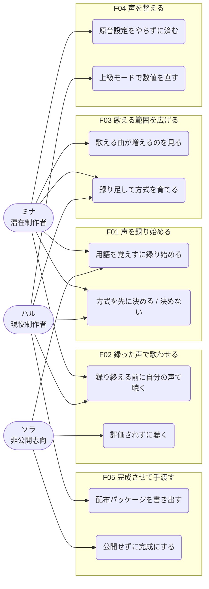
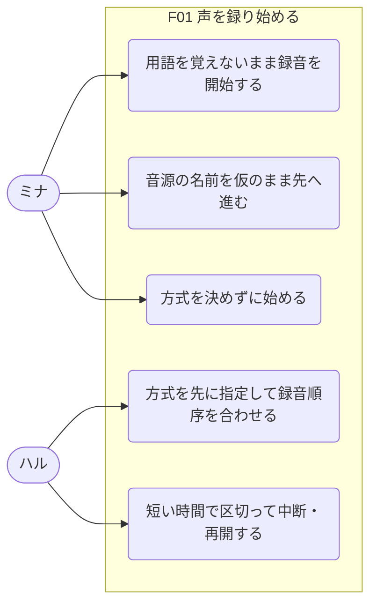
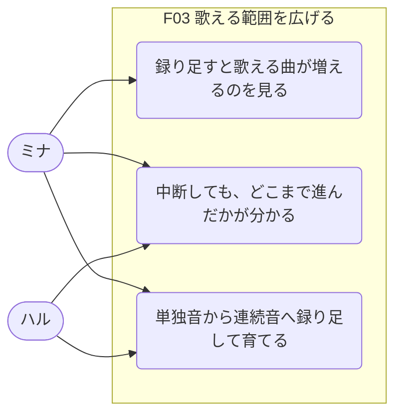
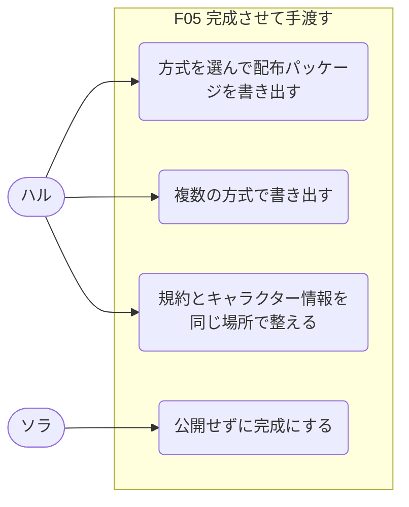

# KOERU ユースケーススケッチ

> Persona が固まった段階で、機能と利用シーンを粗く揃えるための土台。
> 実装仕様ではなく、誰にどんな価値を返すかを確認するための資料。

## 前提

- **参照した入力ソース**: [product-vision.md](./product-vision.md)、[personas.md](./personas.md)、[journey-map.md](./journey-map.md)
- **今回のモード**: 全体俯瞰
- **対象 Persona / Actor**: ミナ（潜在制作者・Primary）、ハル（現役制作者・Primary）、ソラ（非公開志向・Counter-persona）
- **確度の読み方**: 実インタビューは0件。`Fact` はそのユースケースが**調査で確認された障壁やニーズに直接対応している**ことを指し、ユースケース自体が検証済みという意味ではない。

**製品境界について**: 手渡しは配布パッケージの生成までとしているため、**「歌わせる側」（ユウ）は KOERU を使うアクターではない。** パッケージの受け手として製品の外に存在する。図では扱わない。

## アクター、ペルソナ一覧

| Actor / Persona | 概要 | 主な状況 | 主な目的 |
|---|---|---|---|
| **ミナ** | 憧れたが、声より先に用語に会った潜在制作者 | 深夜の自室、スマホとイヤホンマイク。静かな環境と時間がない | 自分の声が歌うのを一度聴く |
| **ハル** | 動機は満タンなのに、段取りで止まる現役制作者 | 平日夜30分か、週末の数時間。RecStar / vLabeler / OpenUtau に慣れている | 往復とやり直しなしで次の音源を出しきる |
| **ソラ** | 自分の声で歌わせたいが、誰にも渡したくない人（Counter-persona） | 深夜、一人。誰にも聴かせない前提でなら声を出せる | 誰にも渡さず、自分だけの声を持つ |
| ユウ | 音源を歌わせる側。**製品範囲外** | OpenUtau で他人の音源を歌わせる | 曲に合う声を見つける |

## 機能一覧

| 機能ID | 機能名 | 何を可能にするか | 主な対象 Actor | 代表ユースケース数 |
|---|---|---|---|---|
| F01 | 声を録り始める | 用語も方式も決めないまま、その場で録音に入れる | ミナ / ハル | 5 |
| F02 | 録った声で歌わせる | 録り終える前に、自分の声で歌を聴ける | ミナ / ハル / ソラ | 3 |
| F03 | 歌える範囲を広げる | 録り足すだけで、歌える曲と音域が増えていく | ミナ / ハル | 3 |
| F04 | 声を整える | 原音設定を自分でやらずに済む。必要な人だけ数値を触れる | ミナ / ハル | 3 |
| F05 | 完成させて手渡す | 配布できる形にする。公開しない完成も選べる | ハル / ソラ | 4 |

## ユースケース一覧

| UC ID | 機能ID | 機能名 | ユースケース | 主アクター | 利用シーン | 期待結果 | 確度 |
|---|---|---|---|---|---|---|---|
| UC-F01-01 | F01 | 声を録り始める | 用語を覚えないまま録音を開始できる | ミナ | 検索から来た初回 | 説明を読まずに最初のフレーズを録れる | Fact |
| UC-F01-02 | F01 | 声を録り始める | 音源の名前を仮のまま先に進められる | ミナ | まだ声を聴いていない起動直後 | 名前で止まらない | Unknown |
| UC-F01-03 | F01 | 声を録り始める | 方式を先に指定して録音順序を合わせられる | ハル | 3本目の着手時 | 決めたい人が決められる | Assumption |
| UC-F01-04 | F01 | 声を録り始める | 方式を決めずに始められる | ミナ / ハル | 着手時 | 既定が「あとで決める」 | Assumption |
| UC-F01-05 | F01 | 声を録り始める | 短い時間で区切って中断・再開できる | ハル | 平日夜の30分 | まとまった時間を要求されない | Assumption |
| UC-F02-01 | F02 | 録った声で歌わせる | 全部録り終える前に自分の声で歌を聴ける | ミナ / ハル | 初回録音の直後 | 「私の声だ」と分かる | Assumption |
| UC-F02-02 | F02 | 録った声で歌わせる | 歌わせた結果から残りの録音方針を決められる | ハル | 序盤の試唱 | 音源の性格が先に分かる | Assumption |
| UC-F02-03 | F02 | 録った声で歌わせる | 評価されずに自分の声を聴ける | ソラ | 初回試唱 | 上手い / 下手の軸が出てこない | Assumption |
| UC-F03-01 | F03 | 歌える範囲を広げる | 録り足すと歌える曲が増えるのが分かる | ミナ | 2回目以降 | 進捗が「歌える曲」で見える | Assumption |
| UC-F03-02 | F03 | 歌える範囲を広げる | 中断しても、どこまで進んだかが分かる | ミナ / ハル | 数日〜数週間後の再訪 | 中断が負債に見えない | Assumption |
| UC-F03-03 | F03 | 歌える範囲を広げる | 単独音から連続音へ、録り足すだけで育てられる | ミナ / ハル | 拡張時 | 方式を意識せずに拡張できる | Unknown |
| UC-F04-01 | F04 | 声を整える | 原音設定を自分でやらずに済む | ミナ | 拡張後 | 自動の切り出しと推定で足りる | Assumption |
| UC-F04-02 | F04 | 声を整える | 確信度が低い箇所だけ確認できる | ミナ | 品質を上げたいとき | 全件を確認しない | Assumption |
| UC-F04-03 | F04 | 声を整える | 上級モードで数値を直接編集できる | ハル | 気になる音の修正 | 既存ツール相当の粒度で直せる | Assumption |
| UC-F05-01 | F05 | 完成させて手渡す | 方式を選んで配布パッケージを書き出せる | ハル | 完成時 | OpenUtau で使える形になる | Fact |
| UC-F05-02 | F05 | 完成させて手渡す | 複数の方式で書き出せる | ハル | 完成時 | 使う人の好みに対応できる | Assumption |
| UC-F05-03 | F05 | 完成させて手渡す | 公開せずに完成にできる | ソラ | 完成時 | 公開を求められない | Assumption |
| UC-F05-04 | F05 | 完成させて手渡す | 規約とキャラクター情報を同じ場所で整えられる | ハル | 完成時 | 配布の知識がなくても形が整う | Fact |

## 全体のユースケース図

**図の読みどころ**: ソラは F02 と F05 にしか線が伸びていない。**「まず歌う」だけがソラにも等しく効き、完成の出口が公開でないルートを必要としている。** ミナとハルは F01 の `方式を先に決める / 決めない` で同じノードを共有しているが、通り方が逆（ミナは決めない、ハルは決める）。

## 機能ごとのユースケース図

F01 声を録り始める

### 機能の簡単な説明

検索から来た人が、説明を読まずに最初のフレーズを録るところまでを担う。方式の選択は既定を「あとで決める」にし、決めたい人には最初から開いておく。名前の入力は通過点であって、判断を求める場所にはしない。

### ユースケース図本体

### 前提 / 未確定事項

- **音源の名前をどう扱うかが未確定。** 仮名で始められるか、あとから改名できるか。ここが決まらないと UC-F01-02 は成立しない
- 「あとで決める」導線を新規層にどう見せるかは未確定
- 方式を先に決めた人と決めなかった人で、録る量に差が出るかは未検討。差があると既定が不利な選択肢になる

F02 録った声で歌わせる

### 機能の簡単な説明

録音の途中でも、その時点の素材で歌を返す。プロダクトの中核はここにある。同時に、自分の声を初めて聴く場面でもあるため、上手い / 下手の評価軸を持ち込まない。

### ユースケース図本体

### 前提 / 未確定事項

- **イヤホンマイク・小声・生活音ありという条件で、聴いて嬉しい歌になるかは未検証。** ここが崩れると、報酬を先に届ける設計が逆効果になる
- 「自分の声が歌う」が本人にとって嬉しい体験かは仮説。恥ずかしさを理由に挙げる層が 22.2% いる
- 試唱までの待ち時間の許容範囲は未確定

F03 歌える範囲を広げる

### 機能の簡単な説明

進捗を録音リストの消化率ではなく「歌える曲の数」で見せる。録り足した結果として、内部的には単独音から連続音へと音源が育つが、そのことを意識させない。

### ユースケース図本体

### 前提 / 未確定事項

- **UC-F03-03 は技術的な前提に依存する。** 方式に依存しない中間表現を保持し、追加録音で拡張できることが必要。成立しなければこの機能とビジョンの差別化が崩れる
- 前回の制作判断（どのリストを使ったか等）を引き継ぐ機能は範囲外。UC-F03-02 が担うのは進捗の可視化までで、文脈の復元ではない
- 「歌える曲」を何本用意するか、どこから調達するかは未確定

F04 声を整える

### 機能の簡単な説明

原音設定を通常モードから隠し、自動の切り出しと推定で済ませる。確信度が低い箇所だけ人に確認させ、数値の直接編集は上級モードでのみ開ける。用語は通常モードに出さない。

### ユースケース図本体

### 前提 / 未確定事項

- **上級モードが既存の原音設定ツールと同等の粒度に届くかが最大の論点。** 届かないと現役制作者は「KOERU で録って別ツールで設定する」という部分利用に落ち、統合の価値が消える
- 自動推定の精度と、確信度をどう提示するかは未確定
- 録音時の品質判定（音量不足、クリッピング、声質の変化）は今回の範囲外。失敗の発見は試唱まで遅れる

F05 完成させて手渡す

### 機能の簡単な説明

配布できる形にするところまでを一つのプロジェクトで完結させる。方式は出力時のオプションとして選ぶ。公開しない完成も正規の完成形として扱い、完成の判定に公開を含めない。

### ユースケース図本体

### 前提 / 未確定事項

- **配布の場は持たない。** 書き出したパッケージがどこへ渡るかは製品の外にあり、**手渡しが実際に起きたかを製品は知れない**
- ニューラル音源データセット形式への書き出しを含むかは未確定
- 完成の定義が2つ（公開する / しない）あるため、進捗表現をどう設計するかは未確定。公開を前提にしたゲージは使えない
- 規約テンプレートをどこまで用意するかは未確定
