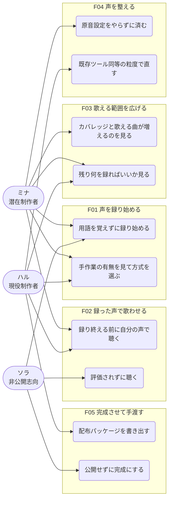
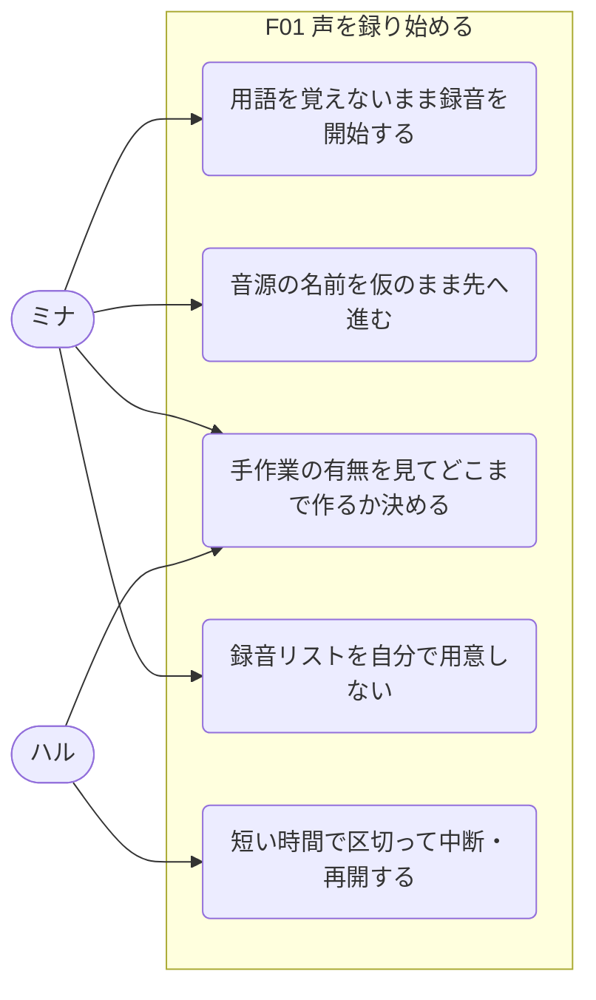
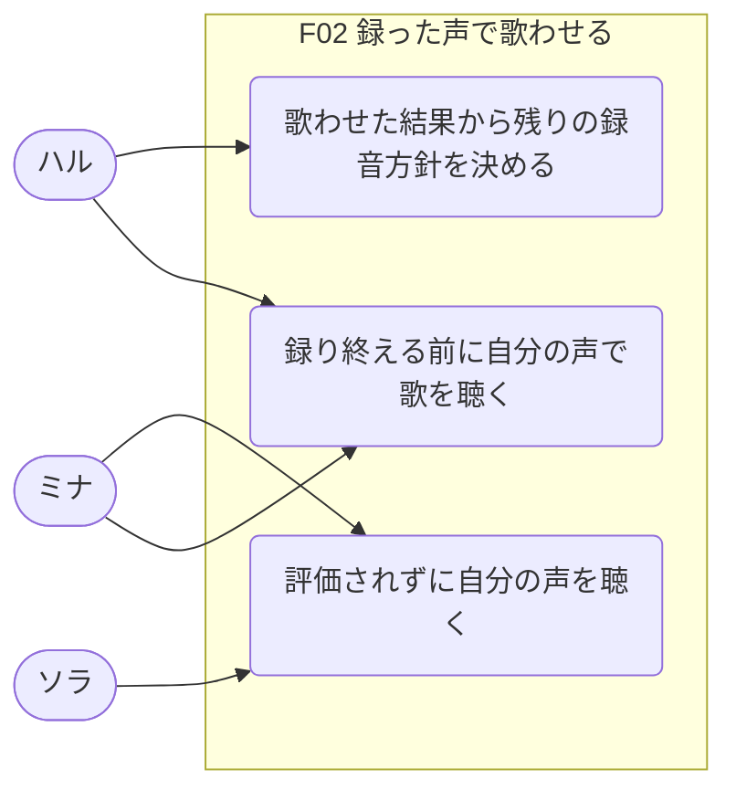
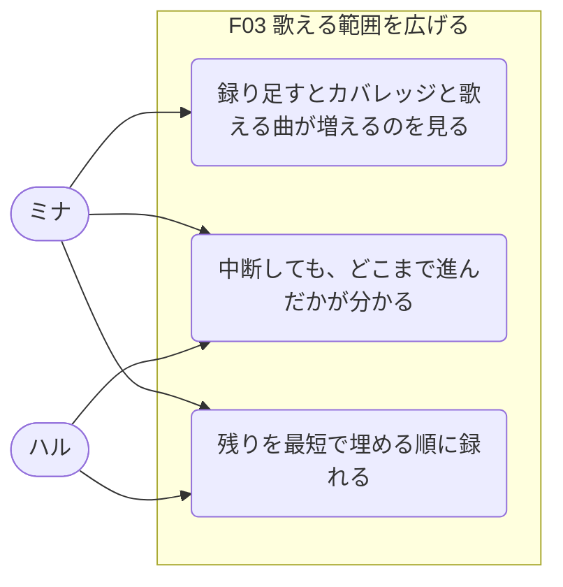
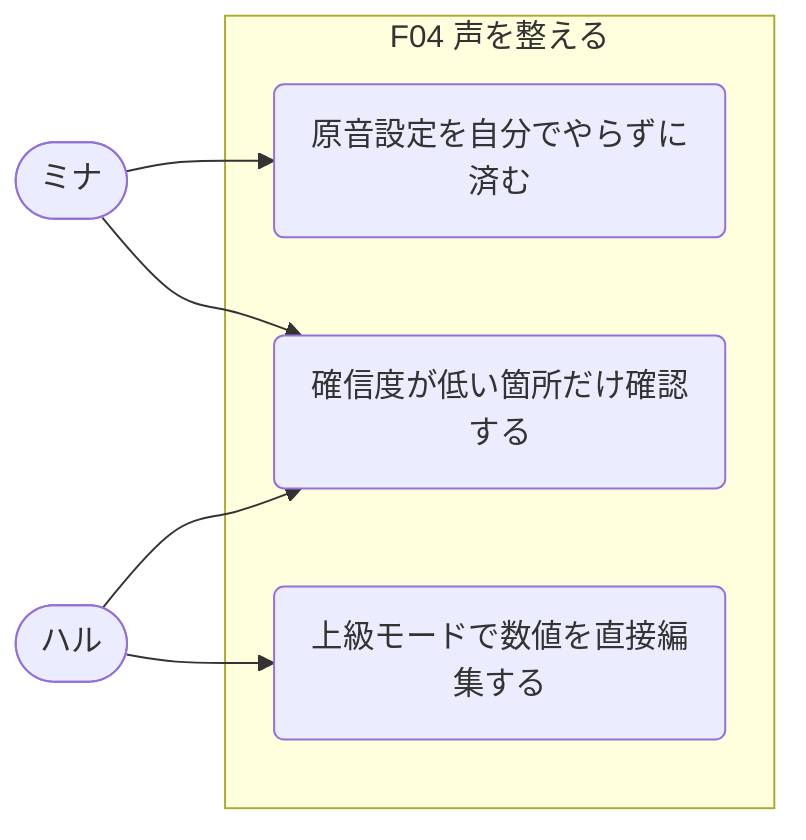
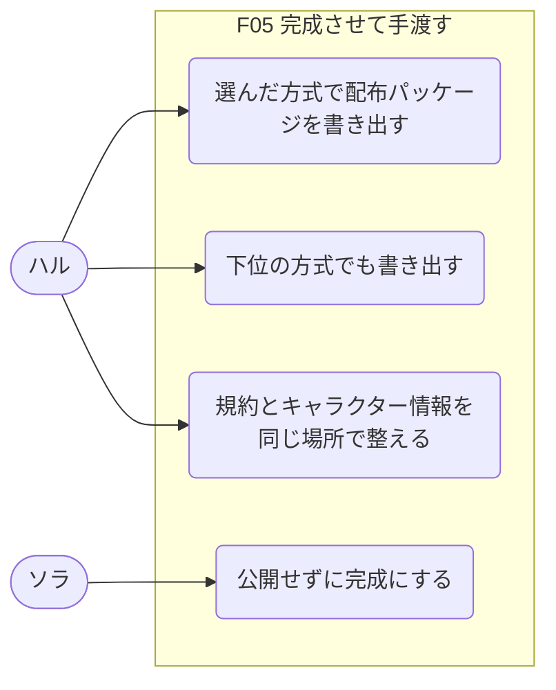

# KOERU ユースケーススケッチ

> Persona が固まった段階で、機能と利用シーンを粗く揃えるための土台。
> 実装仕様ではなく、誰にどんな価値を返すかを確認するための資料。

## 前提

- **参照した入力ソース**: [product-vision.md](./product-vision.md)、[personas.md](./personas.md)、[journey-map.md](./journey-map.md)
- **実装の形**: 単一のネイティブアプリケーション（Rust + Tauri）。PC 前提。処理はローカル完結。AGPL-3.0 で OSS 公開。まず UTAU エコシステムをサポートする
- **今回のモード**: 全体俯瞰
- **対象 Persona / Actor**: ミナ（潜在制作者・Primary）、ハル（現役制作者・Primary）、ソラ（非公開志向・Counter-persona）
- **確度の読み方**: 実インタビューは0件。`Fact` はそのユースケースが**調査で確認された障壁やニーズに直接対応している**ことを指し、ユースケース自体が検証済みという意味ではない。

**製品境界について**: 手渡しは配布パッケージの生成までとしているため、**「歌わせる側」（ユウ）は KOERU を使うアクターではない。** パッケージの受け手として製品の外に存在する。図では扱わない。

## アクター、ペルソナ一覧

| Actor / Persona | 概要 | 主な状況 | 主な目的 |
|---|---|---|---|
| **ミナ** | 憧れたが、声より先に用語に会った潜在制作者 | 深夜の自室、PC とイヤホンマイク。通常の声量を出せる時間が限られる | 自分の声が歌うのを一度聴く |
| **ハル** | 動機は満タンなのに、段取りで止まる現役制作者 | 平日夜30分か、週末の数時間。RecStar / vLabeler / OpenUtau に慣れている | 往復とやり直しなしで次の音源を出しきる |
| **ソラ** | 自分の声で歌わせたいが、誰にも渡したくない人（Counter-persona） | 深夜、一人。誰にも聴かせない前提でなら声を出せる | 誰にも渡さず、自分だけの声を持つ |
| ユウ | 音源を歌わせる側。**製品範囲外** | OpenUtau で他人の音源を歌わせる | 曲に合う声を見つける |

## 機能一覧

| 機能ID | 機能名 | 何を可能にするか | 主な対象 Actor | 代表ユースケース数 |
|---|---|---|---|---|
| F01 | 声を録り始める | 手作業の有無で方式を選び、用語を覚えずに録音に入れる | ミナ / ハル | 5 |
| F02 | 録った声で歌わせる | 録り終える前に、自分の声で歌を聴ける | ミナ / ハル / ソラ | 3 |
| F03 | 歌える範囲を広げる | 録り足すだけで、歌える曲と音域が増えていく | ミナ / ハル | 3 |
| F04 | 声を整える | 原音設定を自動で済ませる。既存ツール同等の編集機能も持つ | ミナ / ハル | 3 |
| F05 | 完成させて手渡す | 配布できる形にする。公開しない完成も選べる | ハル / ソラ | 4 |

## ユースケース一覧

| UC ID | 機能ID | 機能名 | ユースケース | 主アクター | 利用シーン | 期待結果 | 確度 |
|---|---|---|---|---|---|---|---|
| UC-F01-01 | F01 | 声を録り始める | 用語を覚えないまま録音を開始できる | ミナ | 検索から来た初回 | 説明を読まずに最初のフレーズを録れる | Fact |
| UC-F01-02 | F01 | 声を録り始める | 音源の名前を仮のまま先に進められる | ミナ | まだ声を聴いていない起動直後 | 名前で止まらない | Unknown |
| UC-F01-03 | F01 | 声を録り始める | 手作業が必要かどうかを見て、どこまで作るか決められる | ミナ / ハル | 着手時 | 作業をやらされるかが分かった状態で選べる | Assumption |
| UC-F01-04 | F01 | 声を録り始める | 録音リストを自分で用意せずに済む | ミナ / ハル | 着手時 | 選んだ方式に対応するものが用意される | Fact |
| UC-F01-05 | F01 | 声を録り始める | 短い時間で区切って中断・再開できる | ハル | 平日夜の30分 | まとまった時間を要求されない | Assumption |
| UC-F02-01 | F02 | 録った声で歌わせる | 全部録り終える前に自分の声で歌を聴ける | ミナ / ハル | 初回録音の直後 | 「私の声だ」と分かる | Assumption |
| UC-F02-02 | F02 | 録った声で歌わせる | 歌わせた結果から残りの録音方針を決められる | ハル | 序盤の試唱 | 音源の性格が先に分かる | Assumption |
| UC-F02-03 | F02 | 録った声で歌わせる | 評価されずに自分の声を聴ける | ソラ | 初回試唱 | 上手い / 下手の軸が出てこない | Assumption |
| UC-F03-01 | F03 | 歌える範囲を広げる | 録り足すと、カバレッジと歌える曲が両方増えるのが分かる | ミナ / ハル | 2回目以降 | 到達度と手応えが両方見える | Assumption |
| UC-F03-02 | F03 | 歌える範囲を広げる | 中断しても、どこまで進んだかが分かる | ミナ / ハル | 数日〜数週間後の再訪 | 中断が負債に見えない | Assumption |
| UC-F03-03 | F03 | 歌える範囲を広げる | 選んだ方式の中で、あと何を録れば良いか分かる | ミナ / ハル | 録音の途中 | 残りが見える | Assumption |
| UC-F04-01 | F04 | 声を整える | 原音設定を自分でやらずに済む | ミナ | 拡張後 | 自動の切り出しと推定で足りる | Assumption |
| UC-F04-02 | F04 | 声を整える | 確信度が低い箇所だけ確認できる | ミナ | 品質を上げたいとき | 全件を確認しない | Assumption |
| UC-F04-03 | F04 | 声を整える | setParam / vLabeler と同等の粒度で数値を編集できる | ハル | 気になる音の修正 | 人間の編集可能性が残っている | Fact |
| UC-F05-01 | F05 | 完成させて手渡す | 方式を選んで配布パッケージを書き出せる | ハル | 完成時 | OpenUtau で使える形になる | Fact |
| UC-F05-02 | F05 | 完成させて手渡す | 録った方式より下位の方式でも書き出せる | ハル | 完成時 | 使う人の好みに対応できる | Unknown |
| UC-F05-03 | F05 | 完成させて手渡す | 公開せずに完成にできる | ソラ | 完成時 | 公開を求められない | Assumption |
| UC-F05-04 | F05 | 完成させて手渡す | 規約とキャラクター情報を同じ場所で整えられる | ハル | 完成時 | 配布の知識がなくても形が整う | Fact |

## 全体のユースケース図

**図の読みどころ**: ソラは F02 と F05 にしか線が伸びていない。**「まず歌う」だけがソラにも等しく効き、完成の出口が公開でないルートを必要としている。** ミナとハルは F01 の `手作業の有無を見て方式を選ぶ` で同じノードを共有する。同じ画面を見て、ミナは「全自動で完結する」を選び、ハルは「確認作業ありで音質が良い」を選ぶ。**選択肢は同じで、選ぶものが違う。**

## 機能ごとのユースケース図

F01 声を録り始める

### 機能の簡単な説明

検索から来た人が、説明を読まずに最初のフレーズを録るところまでを担う。方式は最初に選ぶが、選択肢は方式名ではなく「手作業が必要かどうか」で示し、所要時間は併記する。名前の入力は通過点であって、判断を求める場所にはしない。

### ユースケース図本体

### 前提 / 未確定事項

- **音源の名前をどう扱うかが未確定。** 仮名で始められるか、あとから改名できるか。ここが決まらないと UC-F01-02 は成立しない
- **「全自動で完結する」を守れるかが自動原音設定の精度に依存する。** 単独音で実用水準に届かなければ、この選択肢そのものが嘘になる。所要時間の数値も併記用に要算出
- ネイティブアプリなので、検索した端末（スマホ）と録る端末（PC）が違う。発見から着手までにインストールという段差が入る。**Windows は WebView2 の固定バージョン同梱で配布サイズが約180MB 増える**

F02 録った声で歌わせる

### 機能の簡単な説明

録音の途中でも、その時点の素材で歌を返す。プロダクトの中核はここにある。同時に、自分の声を初めて聴く場面でもあるため、上手い / 下手の評価軸を持ち込まない。

### ユースケース図本体

### 前提 / 未確定事項

- **イヤホンマイク程度の機材と、家庭の残響・環境ノイズという条件で、聴いて嬉しい歌になるかは未検証。** ここが崩れると、報酬を先に届ける設計が逆効果になる。なお一定品質のマイクと通常の声量は前提として要求している
- 「自分の声が歌う」が本人にとって嬉しい体験かは仮説。恥ずかしさを理由に挙げる層が 22.2% いる
- 試唱までの待ち時間の許容範囲は未確定

F03 歌える範囲を広げる

### 機能の簡単な説明

進捗を**カバレッジと「いま歌える曲の数」の両方**で見せる。カバレッジは収録単位の被覆率であって、行の消化率ではない。**広がるのは、最初に選んだ方式の中でのカバレッジ。**

**歌える曲は入口であって到達点ではない。** 録る順には「曲バンク優先」と「被覆効率」の2つがあり、**曲バンクの全曲が完全になった時点で被覆効率へ切り替わる。本人はいつでも切り替えられ、可逆。** 「もう曲はいいから、残りを最短で埋めさせてほしい」に、待たずに応えられる。

### ユースケース図本体

### 前提 / 未確定事項

- **方式は最初に選ぶため、この機能が広げるのは「選んだ方式の中でのカバレッジ」。** 単独音の素材から連続音は作れない（母音から子音への遷移は連続した発話の中でしか録れない）ため、上位方式へ移るには追加録音が必要になる
- **上位方式への移行経路を用意するかは未決。** 用意する場合、セッションをまたいだ録音の声質不連続が問題になる
- 前回の制作判断（どのリストを使ったか等）を引き継ぐ機能は範囲外。UC-F03-02 が担うのは進捗の可視化までで、文脈の復元ではない
- **同梱するのは1〜2曲。曲バンクは持たない。** 主経路は本人が持ち込む UST / USTX で、任意のノート群を目標にでき、複数をまとめて自分の曲バンクとして構成できる

F04 声を整える

### 機能の簡単な説明

原音設定を通常モードから隠し、自動の切り出しと推定で済ませる。確信度が低い箇所だけ人に確認させる。同時に setParam / vLabeler と同等の編集機能を必ず持ち、上級モードで開放する。用語は通常モードに出さない。

### ユースケース図本体

### 前提 / 未確定事項

- **同等の編集機能は必須要件。** 5値（オフセット / 子音部 / ブランク / 先行発声 / オーバーラップ）の数値編集、波形とスペクトログラム表示、エイリアス一括操作、多音階（prefix.map）対応、ショートカット中心の高速操作を含む。届かないと現役制作者は「KOERU で録って別ツールで設定する」という部分利用に落ちる
- **自動の到達水準が未確定。** 話声の強制アライメントは日本語で平均境界誤差 10ms 台に達しているが、歌声では最新手法でも境界の約2割が 20ms を超えて外れる。UTAU の収録は既知テキスト・短い発話・ほぼ単調な音高なので前者に近いはずだが、**イヤホンマイク程度の機材と家庭の環境ノイズという条件を評価した研究は見つかっていない**
- 確信度の提示方法は未確定。歌声向けアライナには境界ごとの信頼度を出力できるものがあり、UC-F04-02 の実装根拠になる
- 録音時の品質判定（音量不足、クリッピング、声質の変化）は今回の範囲外。失敗の発見は試唱まで遅れる

F05 完成させて手渡す

### 機能の簡単な説明

配布できる形にするところまでを一つのプロジェクトで完結させる。方式は最初に選んだものが既定になる。公開しない完成も正規の完成形として扱い、完成の判定に公開を含めない。

### ユースケース図本体

### 前提 / 未確定事項

- **配布の場は持たない。** 書き出したパッケージがどこへ渡るかは製品の外にあり、**手渡しが実際に起きたかを製品は知れない**
- **ニューラル音源データセット形式（NNSVS / ENUNU / DiffSinger 系）は初期のサポート対象外。** まず UTAU エコシステムをサポートする
- **UC-F05-02 は未検証。** 上位方式で録った素材から下位方式へ書き出せる見込みはある（連続音の録音リストには語頭の単独音相当が含まれるため）が、実用に足る品質になるかは未確認。逆方向はできない
- 完成の定義が2つ（公開する / しない）あるため、進捗表現をどう設計するかは未確定。公開を前提にしたゲージは使えない
- 規約テンプレートをどこまで用意するかは未確定
